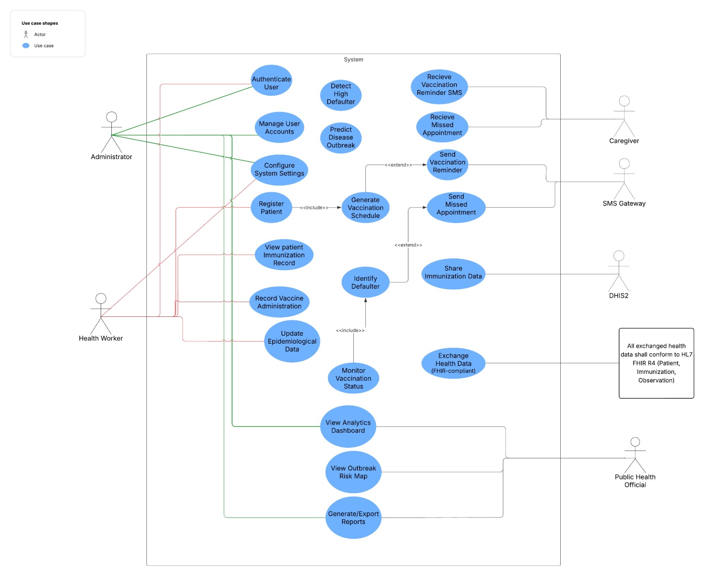

<!-- Auto-generated by documentation/tools/dissect_report.py. Edit the source report or this generator, then rerun the script. -->

# 3.3.3 Use Case Modeling

This subsection identifies the system actors and core use cases that represent the major functionalities of the proposed system. The following diagrams and descriptions will be included:

#### 3.3.3.1. Actor Identification

The system involves primary actors, secondary actors, and external systems, each playing a key role in the operation and functionality of the platform:

- Administrator: Responsible for managing user accounts, configuring system settings, and generating reports.
- Health Worker: Registers children, records vaccine administration, updates epidemiological data, and monitors child immunization.
- Public Health Official: Monitors immunization coverage, views outbreak risk maps, and generates analytical reports.
- Caregiver: Receives notifications for upcoming vaccinations and missed appointments.
- SMS Gateway (External System): Facilitates the delivery of automated SMS notifications to caregivers.
- DHIS2 (External System): Receives synchronized child health and immunization data for national health reporting.
- FHIR System (External System): Supports interoperability by exchanging health data in HL7 FHIR standard format.

#### 3.3.3.2. Use Case Identification

The following table lists all identified use cases required to fulfill the functional requirements of the system.

*Table 3.1: System Use Cases and their Descriptions*

| Use Case ID | Use Case Name | Brief Description |
| --- | --- | --- |
| UC-01 | Authenticate User | Allows administrators and health workers to securely log in to the system. |
| UC-02 | Manage User Accounts | Enables administrators to create, update, and manage user roles and permissions. |
| UC-03 | Configure System Settings | Allows administrators to manage system configurations, facility mappings, and SMS gateway settings. |
| UC-04 | Register Patient | Enables health workers to record patient demographic details and link them to a caregiver. |
| UC-05 | View Immunization Record | Allows health workers to access complete longitudinal vaccination histories for a specific patient. |
| UC-06 | Record Vaccine Administration | Lets health workers record details of administered vaccines (Batch ID, Route, Site). |
| UC-07 | Record Surveillance Data | Captures disease surveillance signals (e.g., AFP, Measles symptoms) and key health indicators. |
| UC-08 | View Analytics Dashboard | Enables administrators and public health officials to view KPIs, coverage rates, and immunization data. |
| UC-09 | View Outbreak Risk Map | Displays geospatial outbreak risk levels and "silent districts" for informed decision-making. |
| UC-10 | Generate and Export Reports | Provides the ability to create customized reports and export them for analysis or sharing. |
| UC-11 | Generate Vaccination Schedule | Automatically calculates recommended vaccination dates based on the patient's DOB and national EPI guidelines. |
| UC-12 | Sync Offline Data | Automatically uploads locally stored records to the central server when internet connectivity is restored. |
| UC-13 | Monitor Vaccination Status | Continuously tracks due and overdue vaccinations in the background. |
| UC-14 | Identify Defaulters | Automatically flags patients who have missed or delayed their scheduled vaccinations. |
| UC-15 | Send Reminder SMS | Automatically notifies caregivers of upcoming doses via the SMS gateway. |
| UC-16 | Send Missed Appointment Alert | Sends follow-up alerts to caregivers when a patient misses a scheduled vaccination. |
| UC-17 | Detect High Defaulter Clusters | Identifies regions or facilities with unusually high default rates using spatial analysis. |
| UC-18 | Predict Disease Outbreak | Uses collected epidemiological and environmental data to forecast potential outbreaks (XGBoost/KNN). |
| UC-19 | Ingest Meteorological Data | Fetches rainfall and temperature data from external APIs to support Cholera prediction models. |
| UC-20 | Share Data with DHIS2 | Synchronizes aggregate and case-based health data with the national DHIS2 system. |
| UC-21 | Exchange Data via FHIR | Formats and transmits health data in HL7 FHIR standard to ensure interoperability. |

#### 3.3.3.3 Use Case Description

*Table 3.2: Authenticate User Use Case Description*

| Field | Details |
| --- | --- |
| Use Case ID | UC-01 |
| Use Case Name | Authenticate User |
| Priority | High |
| Description | Allows administrators, health workers, and officials to securely log in to the system to access functionality based on their assigned role. |
| Trigger | The user opens the mobile application or accesses the web portal URL. |
| Actors | Administrator, Health Worker, Public Health Official |
| Preconditions | User accounts must exist in the database and be in an "Active" state. |
| Main Flow | 1. The user enters their registered email or phone number and password. 2. The system encrypts the input and validates credentials against the database. 3. The system retrieves the user's role (RBAC) and permissions. 4. The system generates a secure session token (JWT). 5. Users are redirected to the dashboard specific to their role. |
| Alternate Flow | A1: Invalid Credentials 1. The system displays "Invalid username or password". 2. Users are prompted to retry. A2: Account Locked 1. If failed attempts > 3, the system locks the account. 2. Users must contact the Administrator for unlock. |
| Postcondition | The user is successfully logged in with an active session. |

*Table 3.3: Manage User Accounts Use Case Description*

| Field | Details |
| --- | --- |
| Use Case ID | UC-02 |
| Use Case Name | Manage User Accounts |
| Priority | Medium |
| Description | Enables the Administrator to create, update, deactivate, and assign roles to system users (e.g., onboarding new Health Workers). |
| Trigger | Administrator selects "User Management" from the admin console. |
| Actors | Administrator |
| Preconditions | Administrator is logged in with valid privileges. |
| Main Flow | 1. Admin selects "Create New User". 2. Admin enters user details (Name, Role, Assigned Facility, Phone). 3. The system validates that the email/phone is unique. 4. The system creates the account with "Inactive" status. 5. The system sends a welcome email/SMS with a temporary password. |
| Alternate Flow | A1: Duplicate User 1. The system detects existing email. 2. System displays error "User already exists" and halts creation. |
| Postcondition | A new user record is created in the database. |

*Table 3.4: Configure System Settings Use Case Description*

| Field | Details |
| --- | --- |
| Use Case ID | UC-03 |
| Use Case Name | Configure System Settings |
| Priority | Low |
| Description | Allows configuration of global system variables, such as Facility mappings, SMS Gateway API keys, and EPI Schedule rules. |
| Trigger | Administrator accesses the "System Settings" menu. |
| Actors | Administrator |
| Preconditions | Administrator privileges required. |
| Main Flow | 1. Admin modifies a specific setting (e.g., updates the default "Measles 2" due date logic). 2. System validates the input format (e.g., checks API key format). 3. Admin clicks "Save Configuration". 4. The system applies changes globally to the backend logic. |
| Alternate Flow | A1: Validation Failure 1. System test-pings the external service (e.g., SMS Gateway). 2. If the connection fails, the system rejects the save and shows an error. |
| Postcondition | System configuration parameters are updated. |

*Table 3.5: Register Patient Use Case Description*

| Field | Details |
| --- | --- |
| Use Case ID | UC-04 |
| Use Case Name | Register Patient |
| Priority | Critical |
| Description | Registers a new patient entity and links them to a caregiver, generating a persistent Unique Identifier (UID) to prevent duplicate records. |
| Trigger | Health Worker selects "New Registration" on the device. |
| Actors | Health Worker |
| Preconditions | Health Worker is logged in (Offline mode is supported). |
| Main Flow | 1. HW enters Patient details (Name, DOB, Sex, Woreda/Kebele). 2. HW enters Caregiver details (Name, Phone Number, Relationship). 3. The system performs a probabilistic check for potential duplicates. 4. The system generates a UID (e.g., ETH-1001-A). 5. The system creates Patient and Caregiver records linked together. 6. The system initializes the Vaccination Schedule based on DOB. |
| Alternate Flow | A1: Duplicate Suspected 1. The system displays a list of similar existing records. 2. HW confirms if it is the same child. 3. If yes, the system redirects to the existing record (merges data). |
| Postcondition | The patient is registered with a UID and an active vaccination schedule. |

*Table 3.6: View Immunization Record Use Case Description*

| Field | Details |
| --- | --- |
| Use Case ID | UC-05 |
| Use Case Name | View Immunization Record |
| Priority | High |
| Description | Retrieves and displays the longitudinal vaccination history and upcoming schedule for a specific patient. |
| Trigger | Health Worker searches for a patient by UID, Name, or Caregiver Phone. |
| Actors | Health Worker |
| Preconditions | Patients must be previously registered in the system. |
| Main Flow | 1. HW scans the patient's QR code or enters the UID. 2. The system fetches the full patient profile from the local or central DB. 3. The system displays the "Vaccination Card" view (Doses Given vs. Due). 4. The system highlights any "Overdue" vaccines in red and "Due Today" in yellow. |
| Alternate Flow | A1: Patient Not Found 1. System search returns no results. 2. System prompts HW to "Register New Patient" (triggers UC-04). |
| Postcondition | The patient's full medical record is displayed to the user. |

*Table 3.7: Record Vaccine Administration Use Case Description*

| Field | Details |
| --- | --- |
| Use Case ID | UC-06 |
| Use Case Name | Record Vaccine Administration |
| Priority | Critical |
| Description | Records the administration of a vaccine dose, including batch number and injection site, updating the patient's history. |
| Trigger | Health Worker clicks "Record Dose" on an open patient profile. |
| Actors | Health Worker |
| Preconditions | The patient record is open and the vaccine is due or overdue. |
| Main Flow | 1. HW selects the specific vaccine (e.g., OPV 1, Measles 1). 2. HW enters the administration date (defaults to current date). 3. HW scans or types the Vaccine Batch ID. 4. The system validates the Batch ID against inventory. 5. The system saves the record locally (if offline) or to the server. 6. The system calculates the next due date based on EPI rules. |
| Alternate Flow | A1: Invalid Batch ID 1. The system displays "Invalid or Expired Batch". 2. HW must correct ID or select " wastage". A2: Offline Mode 1. Record saved to local device storage. 2. Added to the "Pending Sync" queue (see UC-12). |
| Postcondition | Vaccine status updates to "Administered"; next dose is scheduled. |

*Table 3.8: Record Surveillance Data Use Case Description*

| Field | Details |
| --- | --- |
| Use Case ID | UC-07 |
| Use Case Name | Record Surveillance Data |
| Priority | High |
| Description | Captures adverse events following immunization (AEFI) or disease symptoms (e.g., AFP, rash) for outbreak monitoring. |
| Trigger | Health Worker selects "Report Issue" or "Surveillance Form". |
| Actors | Health Worker |
| Preconditions | The patient is registered. |
| Main Flow | 1. HW selects the condition type (e.g., Acute Flaccid Paralysis). 2. HW enters date of onset, clinical symptoms, and temperature. 3. The system flags the patient record for follow-up. 4. The system generates a FHIR Observation resource. 5. The system triggers an immediate alert to the District Health Office. |
| Alternate Flow | A1: Connectivity Failure 1. Alert is queued with a "High Priority" tag. 2. Sent immediately when the network restores. |
| Postcondition | A surveillance signal is logged, and an alert is sent to officials. |

*Table 3.9: View Analytics Dashboard Use Case Description*

| Field | Details |
| --- | --- |
| Use Case ID | UC-08 |
| Use Case Name | View Analytics Dashboard |
| Priority | Medium |
| Description | Displays aggregated Key Performance Indicators (KPIs) like Coverage Rate, Dropout Rate, and Zero-Dose count. |
| Trigger | Public Health Official logs in or clicks the "Dashboard" tab. |
| Actors | Public Health Official, Administrator |
| Preconditions | Users have "Viewer" or "Admin" permissions. |
| Main Flow | 1. The user selects the geographic level (National, Region, Woreda). 2. The system queries the database for aggregated statistics. 3. System renders visualizations (Bar charts for coverage, Line charts for trends). 4. User filter data by time period (e.g., "Last Quarter"). |
| Alternate Flow | A1: No Data Available 1. The system displays "No reports received for this criteria". |
| Postcondition | An interactive dashboard is displayed to the user. |

*Table 3.10: View Outbreak Risk Map Use Case Description*

| Field | Details |
| --- | --- |
| Use Case ID | UC-09 |
| Use Case Name | View Outbreak Risk Map |
| Priority | Critical |
| Description | Visualizes geographic areas at high risk of disease outbreak based on the predictive machine learning model. |
| Trigger | Official selects "Risk Map" from the navigation menu. |
| Actors | Public Health Official |
| Preconditions | The Prediction Model (UC-18) has run successfully. |
| Main Flow | 1. The user loads the map interface. 2. The system overlays a color-coded risk heatmap (Red = High Risk). 3. System highlights "Silent Districts" (Gray) where data is missing. 4. Users click a specific district to view contributing factors (e.g., "Low Coverage + High Rainfall"). |
| Alternate Flow | A1: Map Service Unavailable 1. The system displays a tabular list of high-risk districts as a fallback. |
| Postcondition | User views actionable geospatial risk data. |

*Table 3.11: Generate and Export Reports Use Case Description*

| Field | Details |
| --- | --- |
| Use Case ID | UC-10 |
| Use Case Name | Generate and Export Reports |
| Priority | Medium |
| Description | Generates standard tabular reports for administrative reporting and compliance. |
| Trigger | Administrator or Official clicks "Reports". |
| Actors | Administrator, Public Health Official |
| Preconditions | None. |
| Main Flow | 1. User selects Report Type (e.g., "Monthly Immunization Summary"). 2. User sets date range and specific facility filters. 3. The system generates a preview of the report. 4. The user clicks "Export PDF" or "Export CSV". |
| Alternate Flow | A1: Generation Timeout 1. The system notifies the user "Report is processing, link will be emailed". |
| Postcondition | The report file is downloaded to the user's device. |

*Table 3.12: Generate Vaccination Schedule Use Case Description*

| Field | Details |
| --- | --- |
| Use Case ID | UC-11 |
| Use Case Name | Generate Vaccination Schedule |
| Priority | Critical |
| Description | Automatically calculates and assigns specific due dates for all required vaccines based on the patient's Date of Birth (DOB) and the National Expanded Programme on Immunization (EPI) guidelines. |
| Trigger | Automatic: Immediately after a new patient is registered (UC-04). Automatic: Re-triggered if the EPI schedule configuration is updated (UC-03). |
| Actors | System Rule Engine |
| Preconditions | A patient record exists with a valid Date of Birth. |
| Main Flow | 1. The system retrieves the patient's DOB. 2. The system loads the active EPI Rule Set (e.g., BCG = Birth, Penta1 = DOB + 6 weeks, Measles = DOB + 9 months). 3. The system calculates the specific calendar due date for each vaccine dose. 4. The system inserts records into the VaccinationSchedule table with status "Pending". 5. The system sorts the schedule chronologically for display. |
| Alternate Flow | A1: Premature Birth/Medical Exception 1. If "Medical Contraindication" is flagged during registration. 2. System adjusts specific vaccine dates or marks them as "Exempt" based on configured medical rules. |
| Postcondition | The patient has a complete, date-specific roadmap of future vaccination appointments. |

*Table 3.13: Sync Offline Data Use Case Description*

| Field | Details |
| --- | --- |
| Use Case ID | UC-12 |
| Use Case Name | Sync Offline Data |
| Priority | Critical |
| Description | Synchronizes locally cached patient and immunization data with the central server when internet connectivity is available. |
| Trigger | Automatic: Network connection restored. Manual: User clicks "Sync Now" button. |
| Actors | Health Worker (System Assisted) |
| Preconditions | Pending records exist in the local browser storage (IndexedDB). |
| Main Flow | 1. Application detects active internet connection. 2. App retrieves all "Pending" records from local storage. 3. The app sends a data batch to the server API via secure POST. 4. Server validates data and commits to the central database. 5. Server returns an Acknowledgement (ACK). 6. The app marks local records as "Synced" and clears the upload queue. |
| Alternate Flow | A1: Server Conflict 1. Server rejects a record (e.g., "Update conflict"). 2. The app flags the record for manual review by the Health Worker. |
| Postcondition | Local and Central databases are consistent. |

*Table 3.14: Monitor Vaccination Status Use Case Description*

| Field | Details |
| --- | --- |
| Use Case ID | UC-13 |
| Use Case Name | Monitor Vaccination Status |
| Priority | High |
| Description | A background process that continuously tracks the vaccination schedule for every registered patient to determine if they are Due, Overdue, or Up-to-Date. |
| Trigger | Automatic: Daily scheduled task (Cron Job) at 00:00 AM. |
| Actors | System Scheduler |
| Preconditions | Patients exist with active vaccination schedules. |
| Main Flow | 1. The system scans all active patient records. 2. The system compares the current date against the "Next Due Date" for pending vaccines. 3. If CurrentDate == DueDate - 24 hours, tag as "Due Soon". 4. If CurrentDate > DueDate, tag as "Overdue". 5. The system updates the status flags in the database. |
| Alternate Flow | None. |
| Postcondition | All patient vaccination statuses are current for the day. |

*Table 3.15: Identify Defaulters Use Case Description*

| Field | Details |
| --- | --- |
| Use Case ID | UC-14 |
| Use Case Name | Identify Defaulters |
| Priority | Critical |
| Description | Automatically identifies patients who have missed a scheduled vaccination by a specific threshold (e.g., > 7 days) and flags them for intervention. |
| Trigger | Automatic: Runs immediately after UC-13 (Monitor Status). |
| Actors | System Scheduler |
| Preconditions | Vaccination statuses have been updated. |
| Main Flow | 1. System queries for records tagged "Overdue". 2. The system checks the duration of delay. 3. If Delay > 7 Days, the system changes status to "Defaulter". 4. The system adds the patient to the "Defaulter Tracking List" for Health Extension Workers (HEWs). |
| Alternate Flow | None. |
| Postcondition | The default list is populated for the day's outreach tasks. |

*Table 3.16: Send Reminder SMS Use Case Description*

| Field | Details |
| --- | --- |
| Use Case ID | UC-15 |
| Use Case Name | Send Reminder SMS |
| Priority | High |
| Description | Sends automated SMS notifications to Caregivers reminding them of upcoming vaccination appointments (e.g., 24 hours before due date). |
| Trigger | Automatic: Daily batch job (e.g., 8:00 AM). |
| Actors | System Scheduler, SMS Gateway (External) |
| Preconditions | The patient is tagged "Due Soon" (from UC-13) and Caregiver has a phone number. |
| Main Flow | 1. The system retrieves a list of patients due in 24 hours. 2. The system looks up Caregiver phone number and preferred language. 3. The system constructs the message (e.g., "Reminder: [Name] is due for vaccine tomorrow."). 4. The system pushes messages to SMS Gateway. 5. The system logs the notification as "Sent". |
| Alternate Flow | A1: Gateway Failure 1. SMS Gateway returns error. 2. The system marks the notification as "Pending Retry". |
| Postcondition | Caregivers are notified of upcoming appointments. |

*Table 3.17: Send Missed Appointment Alert Use Case Description*

| Field | Details |
| --- | --- |
| Use Case ID | UC-16 |
| Use Case Name | Send Missed Appointment Alert |
| Priority | High |
| Description | Sends an urgent follow-up SMS to Caregivers when a vaccination appointment is missed, encouraging immediate action. |
| Trigger | Automatic: Triggered when a patient status changes to "Overdue". |
| Actors | System Scheduler, SMS Gateway (External) |
| Preconditions | Patient status is "Overdue". |
| Main Flow | 1. The system identifies patients who missed their appointment yesterday. 2. System constructs an alert message (e.g., "Alert: [Name] missed a vaccine. Please visit the health center immediately."). 3. The system pushes messages to SMS Gateway. 4. The system logs the alert in the patient's history. |
| Alternate Flow | A1: Invalid Phone Number 1. System logs "Delivery Failed". 2. The system adds patient to "Physical Trace" list for HEWs. |
| Postcondition | Missed appointment alerts are dispatched. |

*Table 3.18: Detect High Defaulter Clusters Use Case Description*

| Field | Details |
| --- | --- |
| Use Case ID | UC-17 |
| Use Case Name | Detect High Defaulter Clusters |
| Priority | Medium |
| Description | Analyzes spatial data to identify villages or woredas with unusually high rates of vaccine defaulters (Hotspots). |
| Trigger | Automatic: Weekly analytics job. |
| Actors | System Analytics Engine |
| Preconditions | Sufficient data exists in the Defaulter table. |
| Main Flow | 1. The system aggregates default counts by location (Woreda/Kebele). 2. System calculates Defaulter Rate (%) per location. 3. The system runs a spatial clustering algorithm (e.g., DBSCAN/K-Means). 4. System flags locations with rate > Threshold (e.g., 10%) as "High Risk Clusters". |
| Alternate Flow | None. |
| Postcondition | Hotspot clusters are identified and highlighted on the dashboard. |

*Table 3.19: Predict Disease Outbreak Use Case Description*

| Field | Details |
| --- | --- |
| Use Case ID | UC-18 |
| Use Case Name | Predict Disease Outbreak |
| Priority | Critical |
| Description | Runs machine learning models (XGBoost/KNN) using vaccination coverage, surveillance reports, and environmental data to forecast outbreak risks. |
| Trigger | Automatic: Daily or On-Demand by Official. |
| Actors | System Analytics Engine, ML Model Service |
| Preconditions | Meteorological data (UC-19) and Health data are available. |
| Main Flow | 1. The system fetches the latest health data (Dropout rates, Zero-dose counts). 2. The system fetches the latest environmental data (Rainfall, Temp). 3. The system feeds features into the pre-trained ML model.\ 4. The model outputs a Risk Probability Score (0.0 - 1.0) for each district. 5. The system stores scores for the Risk Map (UC-09). |
| Alternate Flow | A1: Insufficient Data 1. System flags the district as "Silent" (Unknown Risk). |
| Postcondition | Risk scores are updated for all districts. |

*Table 3.20: Ingest Meteorological Data Use Case Description*

| Field | Details |
| --- | --- |
| Use Case ID | UC-19 |
| Use Case Name | Ingest Meteorological Data |
| Priority | Medium |
| Description | Fetches external weather data (rainfall, temperature) which are key variables for predicting waterborne diseases like Cholera. |
| Trigger | Automatic: Scheduled job (e.g., every 6 hours). |
| Actors | System Scheduler, External Weather API |
| Preconditions | API keys for weather service are valid. |
| Main Flow | 1. The system requests weather data for monitored coordinates (Woredas). 2. External API returns JSON data (Precipitation, Max Temp). 3. The system parses and normalizes the data. 4. The system stores records in the "Environmental Factors" database table. |
| Alternate Flow | A1: API Downtime 1. System retries 3 times. 2. If failed, logs error and uses last known values for prediction. |
| Postcondition | The latest weather data is available for the prediction engine. |

*Table 3.21: Share Data with DHIS2 Use Case Description*

| Field | Details |
| --- | --- |
| Use Case ID | UC-20 |
| Use Case Name | Share Data with DHIS2 |
| Priority | High |
| Description | Synchronizes aggregate health indicators and case-based data with the national DHIS2 platform to ensure regulatory compliance. |
| Trigger | Automatic: Weekly sync schedule (or Manual trigger). |
| Actors | System Interoperability Service, DHIS2 Platform |
| Preconditions | DHIS2 API endpoint is reachable. |
| Main Flow | 1. The system identifies new records created since the last sync. 2. The system maps internal data fields to DHIS2 Data Elements. 3. The system converts data to DHIS2-compatible JSON format. 4. The system pushes data to the DHIS2 Import API. 5. DHIS2 returns an Import Summary. 6. System logs the sync status. |
| Alternate Flow | A1: Validation Error 1. DHIS2 rejects specific records (e.g., "Invalid Org Unit"). 2. System logs error details for Admin review. |
| Postcondition | The national DHIS2 system is updated with the latest local data. |

*Table 3.22: Exchange Health Data via FHIR Use Case Description*

| Field | Details |
| --- | --- |
| Use Case ID | UC-21 |
| Use Case Name | Exchange Health Data via FHIR |
| Priority | High |
| Description | Enables the system to exchange clinical data with other external electronic medical record (EMR) systems by mapping internal data to the HL7 FHIR (Fast Healthcare Interoperability Resources) standard. |
| Trigger | Automatic: Scheduled data exchange. External: Request received from an authorized external system. |
| Actors | System Interoperability Service, External EMR/EHR Systems |
| Preconditions | External system is authenticated and authorized to access the API. |
| Main Flow | 1. System receives a request for patient data (or triggers a push event). 2. System retrieves the relevant internal records (Demographics, Vaccinations, Adverse Events). 3. System maps internal entities to FHIR Resources: - Patient Entity -Patient resource. - Vaccination Record - Immunization resource. - Surveillance Signal - Observation resource. 4. The system bundles resources into a JSON FHIR Bundle. 5. The system transmits the bundle via the REST API endpoint. 6. The system logs the transaction for audit purposes. |
| Alternate Flow | A1: Schema Validation Failure 1. If a mandatory FHIR field is missing (e.g., Patient Gender), the system logs a "Mapping Error". 2. The specific record is skipped, and the error is flagged for admin review. |
| Postcondition | Health data is shared in a standardized, globally recognized format. |

#### 3.3.3.4. Use Case Diagram

*Figure 3.1: Use Case Diagram of the National Vaccination and Outbreak Monitoring System*
