<!-- Auto-generated by documentation/tools/dissect_report.py. Edit the source report or this generator, then rerun the script. -->

# 3.3.4 Dynamic Models of the System

Dynamic models are used to represent the behavior of the system over time, illustrating interactions, workflows, and state transitions in response to events.

#### 3.3.4.1 Sequence Diagram

This section presents the dynamic behavioral modeling of the National Vaccination and Outbreak Monitoring System. The Sequence Diagrams detailed below illustrate how these functions are executed over time.

These diagrams depict the interactions between system actors, internal system objects, and external entities. They provide a granular view of the message flow, data exchange protocols, and control logic.

The sequence diagrams are organized into six functional groups, corresponding to the system's core modules:

1. User Management and Security

This operation describes the secure onboarding and authentication lifecycle of system users. It illustrates how an Administrator creates a role-based account (e.g., for a Health Worker) and how the system subsequently validates login credentials against a secure database. It also details the "Happy Path" for a successful login and the alternative flow for password recovery via an email service if authentication fails.

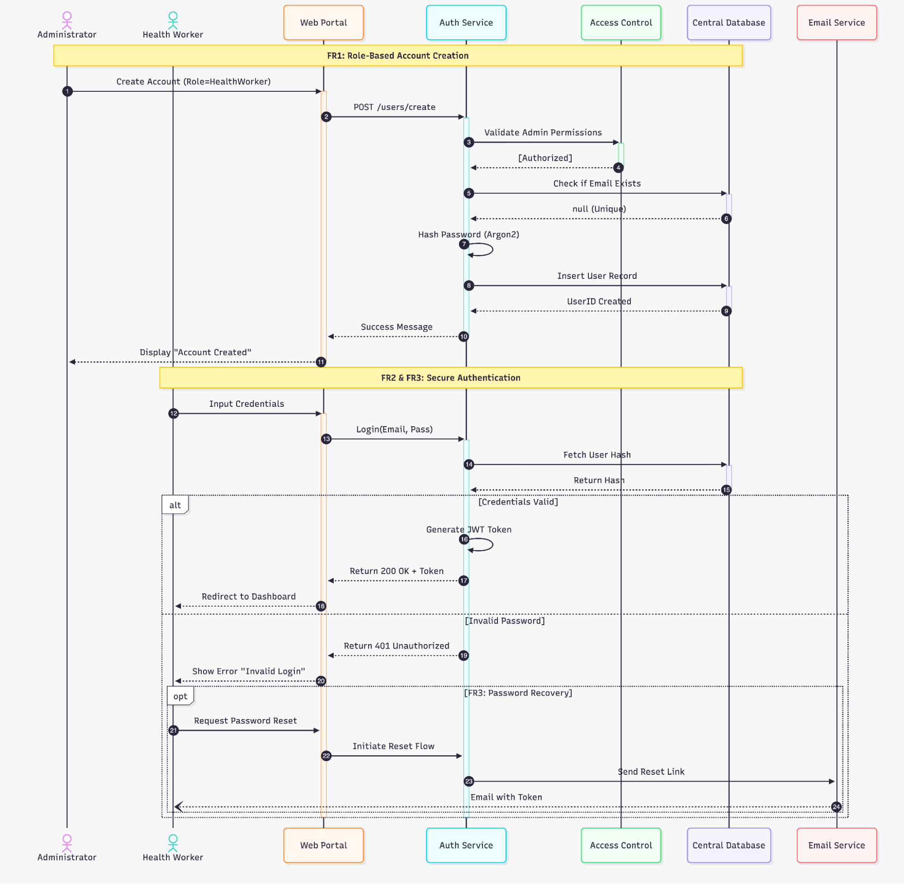

*Figure 3.2: Sequence Diagram – User Management and Security*

2. Patient and Caregiver Registration

This operation describes the atomic process of registering a new patient to ensure data integrity and prevent "phantom coverage." It shows the workflow where a Health Worker submits demographic data, which triggers a check for duplicate records. Once cleared, the system generates a Unique Identifier (UID) and commits both the Patient and Caregiver entities to the database in a single transaction, ensuring that a patient cannot exist without a linked caregiver.

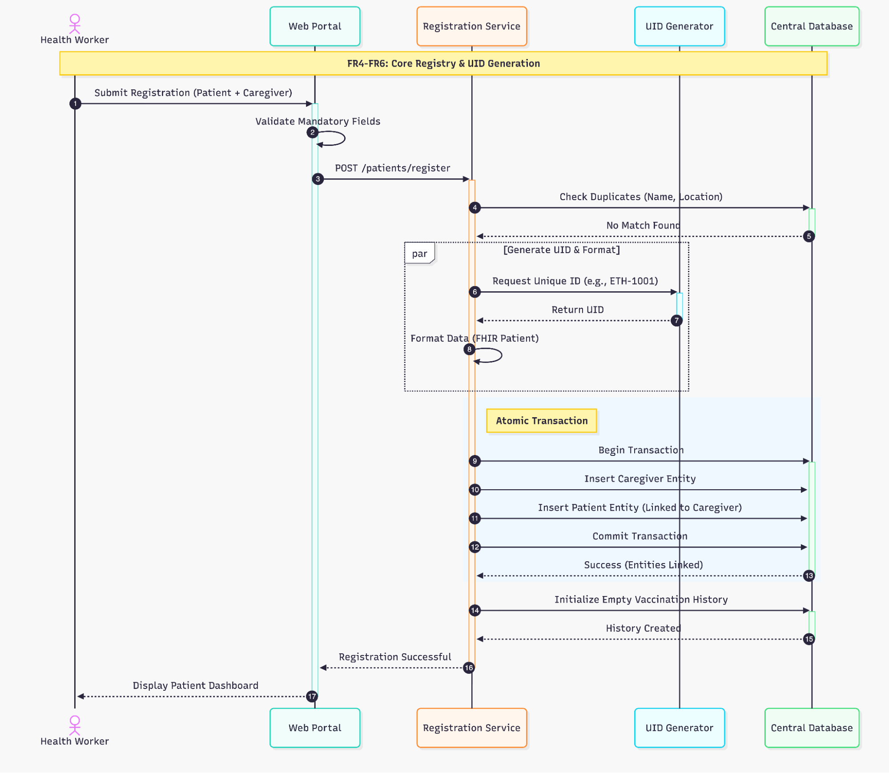

*Figure 3.3: Sequence Diagram – Patient and Caregiver Registration*

3. Immunization and Surveillance Management

This operation describes the "offline-first" clinical workflow designed for low-resource settings. It details how a Health Worker records vaccination doses and surveillance observations (like fever) locally on their device. The diagram then traces the synchronization process: detecting connectivity, uploading pending records to the central database, and automatically triggering the scheduler engine to calculate the next due date based on national EPI guidelines.

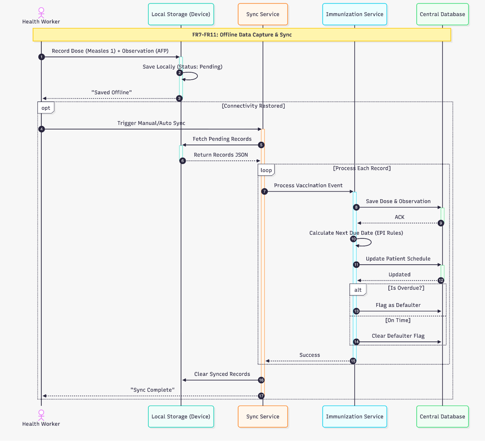

*Figure 3.4: Sequence Diagram – Immunization and Surveillance Management*

4. Notifications and Alerts

This operation describes the automated background automation that drives patient retention. It depicts a scheduled task (Cron Job) that runs daily to query the database for two specific cohorts: patients due for vaccines in 24 hours and those who have missed appointments. The system then constructs localized messages and dispatches them through an external SMS Gateway to the caregivers, handling potential network failures via a retry mechanism.

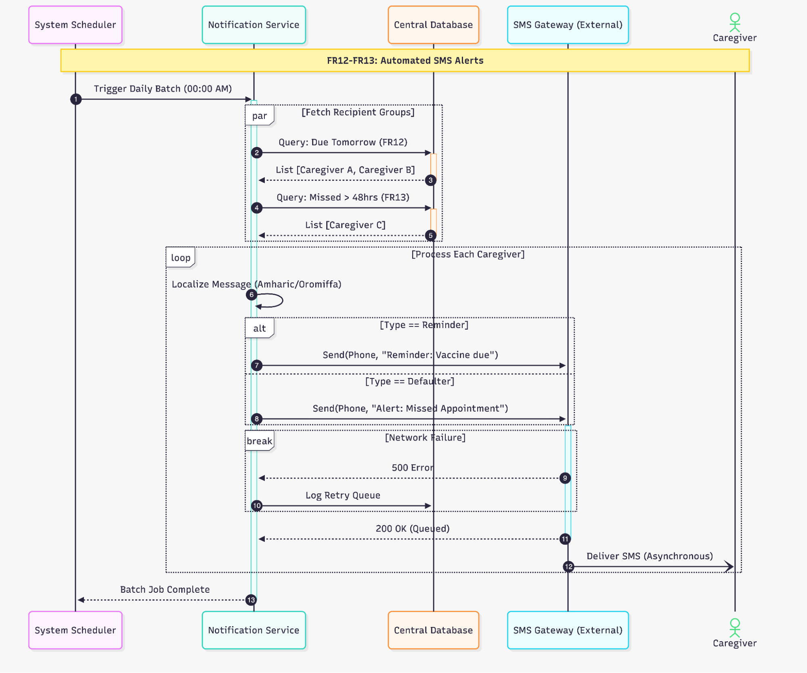

*Figure 3.5: Sequence Diagram – Notifications and Alerts*

5. Predictive Analytics and Decision Support

This operation describes the advanced data fusion and decision-support pipeline. It illustrates how a request from a Public Health Official triggers the aggregation of internal health data (dropout rates) and external meteorological data (rainfall/temperature). These distinct datasets are fed into the Machine Learning engine (running KNN and XGBoost models) to calculate risk scores, which are finally rendered as an interactive risk map for the user.

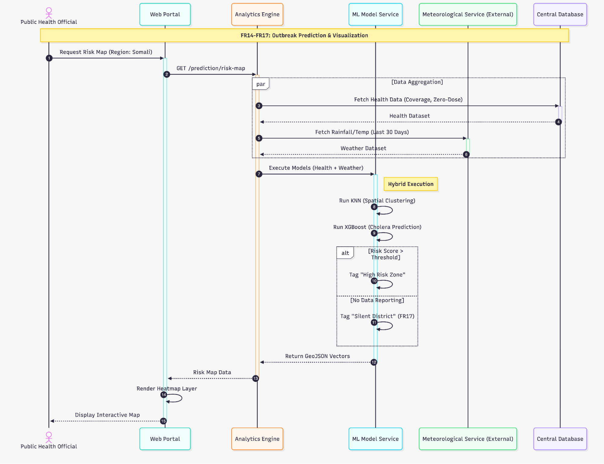

*Figure 3.6: Sequence Diagram – Predictive Analytics and Decision Support*

6. Reporting and Interoperability

This operation describes the data exchange pipeline required for national compliance. It shows two distinct flows: first, the manual generation of administrative reports (PDF/CSV) for local use; and second, the automated synchronization process where the system maps internal database records to standard HL7 FHIR resources (Patient, Immunization, Observation) and transmits them to the national DHIS2 platform.

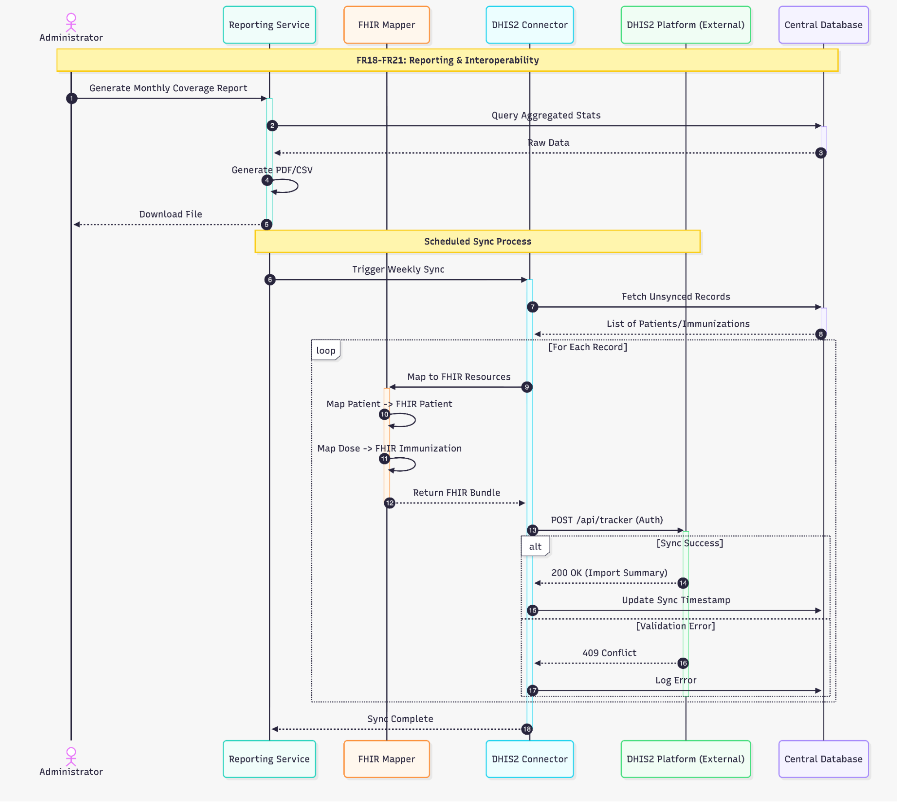

*Figure 3.7: Sequence Diagram – Reporting and Interoperability*

#### 3.3.4.2 State Machine Diagram

1. User Account Lifecycle

This operation describes the security and session status of a system user (e.g., a Health Worker). It illustrates the transition from account creation to active usage, including the security logic that automatically moves an account to a "Locked" state after three failed login attempts. It also details the "Happy Path" where users cycle between "Active" and "Idle" states during normal work, ensuring sessions are timed out for security.

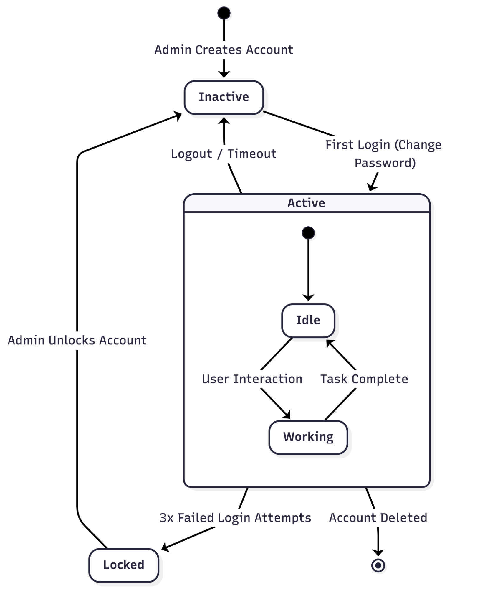

*Figure 3.8: State Machine Diagram – User Account Lifecycle*

2. Patient Registration Flow

This operation describes the identity verification logic required during the registration process to prevent "phantom coverage." It traces the lifecycle of a patient record from a temporary "Draft" state to a "Verifying" state, where the system checks against the central database. The diagram shows the critical decision point: if a duplicate is found, the record is rejected; if unique, it transitions to "Registered" and is permanently saved.

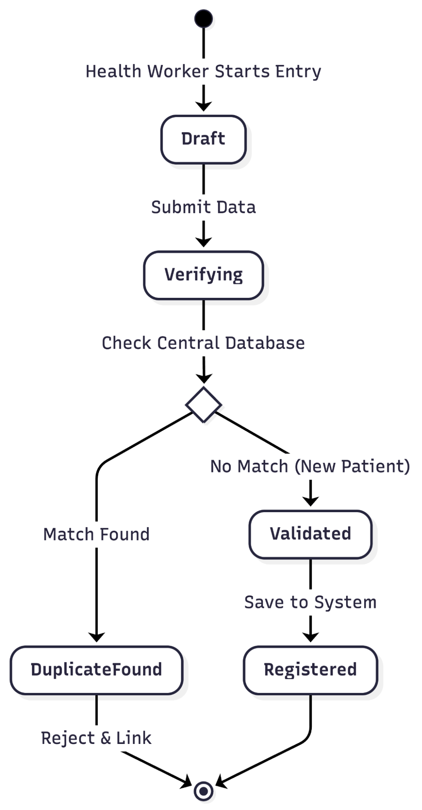

*Figure 3.9: State Machine Diagram – Patient Registration Flow*

3. Vaccination Appointment Lifecycle

This operation describes the clinical timeline of a single vaccine dose (e.g., Measles 1) from the moment it is scheduled. It models the time-based transitions that move a dose from "Due" to "Overdue" and finally to "Defaulter status" if too much time passes. Crucially, it illustrates the "Offline-First" capability, showing how an administered dose can be "Stored Locally" on a device before eventually transitioning to the "Synced" state when internet connectivity is restored.

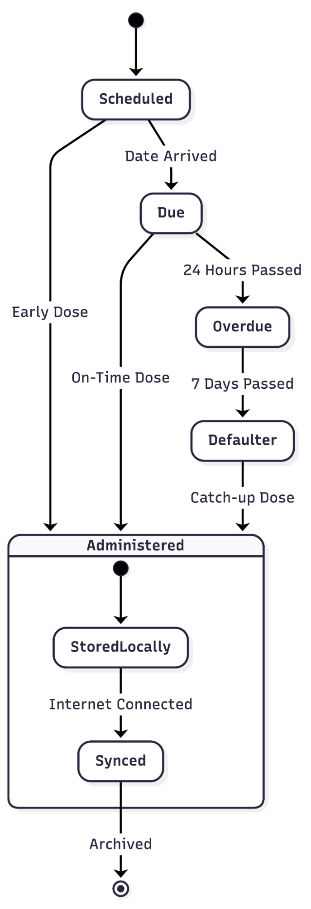

*Figure 3.10: State Machine Diagram – Vaccination Appointment Lifecycle*

4. SMS Notification Flow

This operation describes the automated lifecycle of a reminder message sent to a caregiver. It shows the flow from message generation by the daily batch job to its transmission to the external gateway. The diagram highlights the system's resilience logic, detailing how a message can enter a "Retrying" loop upon failure before either succeeding ("Delivered") or being marked as "Failed" to stop resource wastage.

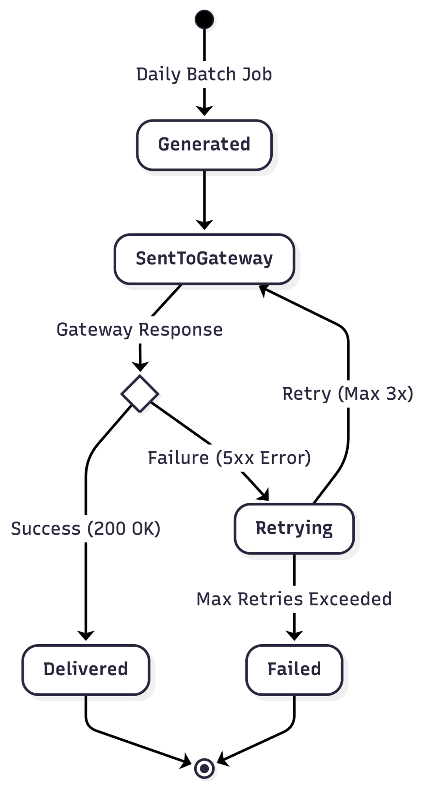

*Figure 3.11: State Machine Diagram – SMS Notification Flow*

5. Outbreak Alert Logic

This operation describes the surveillance workflow that transforms raw data into actionable alerts. It illustrates how the system continuously moves between "Monitoring" and "Processing" as new data arrives. It details the decision logic where the predictive model calculates a risk score; if the score exceeds a threshold, the state elevates to "Potential Alert," requiring verification by an official before being confirmed as an "Outbreak."

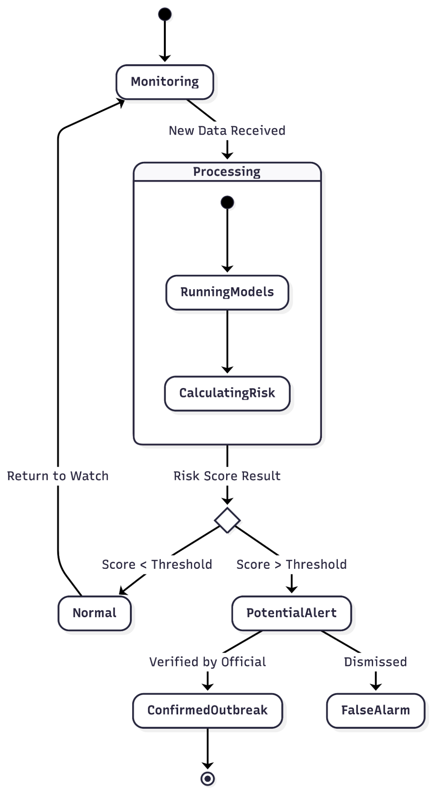

*Figure 3.12: State Machine Diagram – Outbreak Alert Logic*

6. Data Export (Interoperability) Flow

This operation describes the background process responsible for synchronizing data with the national DHIS2 platform. It traces the lifecycle of an export job, starting with "Assembling Data" and "Mapping to FHIR" standards. The diagram emphasizes the validation state, showing how the system ensures data structure compliance before attempting transmission, with distinct paths for successful completion or error logging.

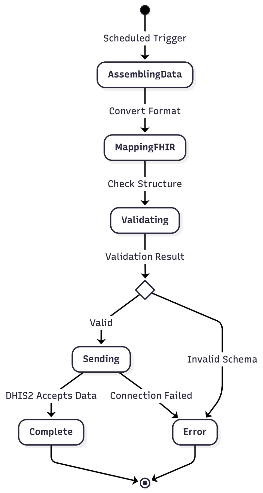

*Figure 3.13: State Machine Diagram – Data Export and Interoperability Flow*

#### 3.3.4.3 Activity Diagram

1. Activity Diagram for User Management and Security

This diagram illustrates the workflow for managing user accounts, authentication, and security features. It starts with user registration or login attempts, includes decision points for authentication and authorization, and handles password recovery. The process ensures role-based access and secure administrative oversight, incorporating role-based account creation, secure authentication and authorization, and password recovery and admin management. It accounts for offline support as a non-functional requirement by allowing local actions before sync.

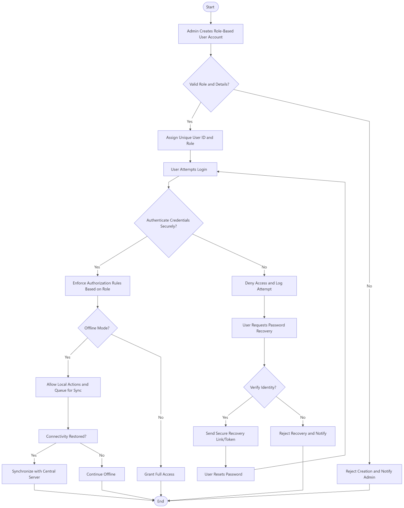

*Figure 3.14: Activity Diagram – User Management and Security*

1. Activity Diagram for Patient and Caregiver Registration

This diagram depicts the core registry process for registering patients and linking them to caregivers. It includes steps for capturing demographic details, generating unique IDs to prevent duplication, and maintaining vaccination history. Based on register patient with demographics and link to caregiver, generate UID, and maintain digital vaccination history. Non-functional aspects like security (encryption) and usability (intuitive UI) are implied in validation steps.

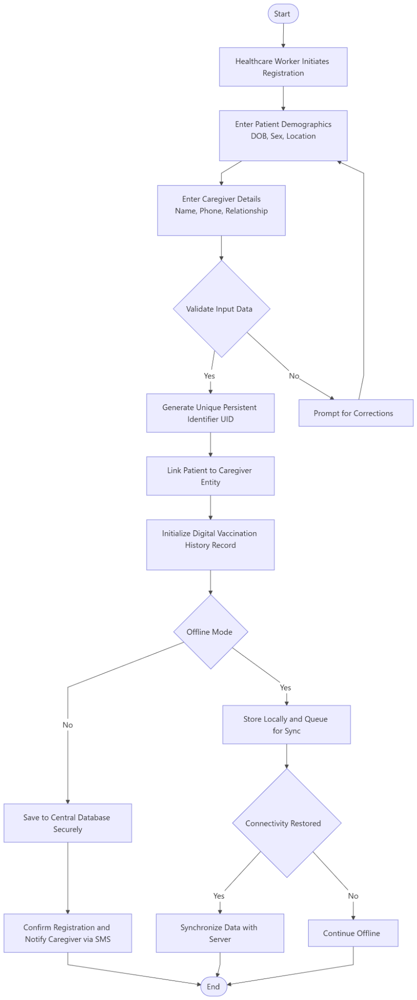

*Figure 3.15: Activity Diagram – Patient and Caregiver Registration*

1. Activity Diagram for Immunization and Surveillance Management

This diagram covers the management of immunization schedules, recording doses, surveillance observations, and flagging issues like zero-dose or defaulters. It includes offline capabilities for data entry. Derived from generating schedules, record doses with metadata, offline recording and sync, flag zero-dose/defaulters, and record surveillance observations. Reliability and scalability are considered in sync mechanisms.

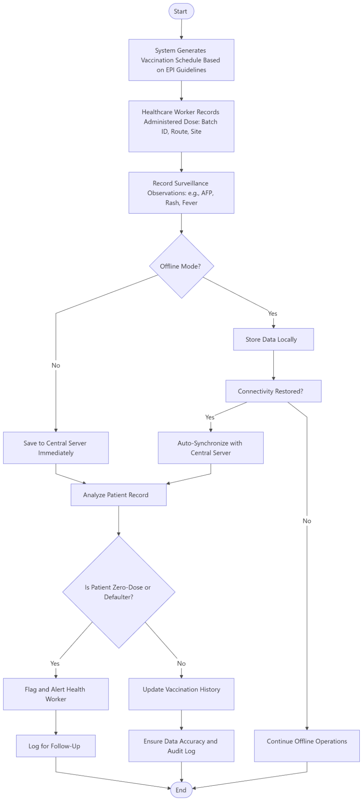

*Figure 3.16: Activity Diagram – Immunization and Surveillance Management*

1. Activity Diagram for Notifications and Alerts

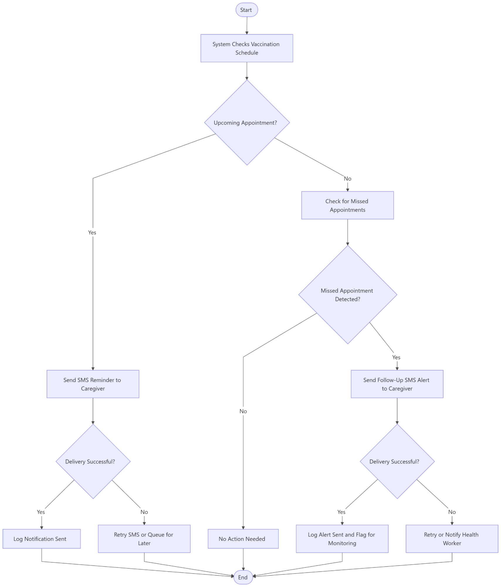

This diagram focuses on sending automated SMS notifications for appointments and follow-ups. It triggers based on schedules and missed events, aiming to reduce dropouts. SMS reminders for upcoming appointments and follow-up alerts for missed appointments are also represented. Performance (fast response) and infrastructure dependence (GSM network) are key non-functional considerations, with fallbacks for delivery failures.

*Figure 3.17: Activity Diagram – Notifications and Alerts*

1. Activity Diagram for Predictive Analytics and Decision Support

This diagram outlines the process of ingesting data, running predictive models, detecting clusters, and visualizing risks. It integrates external data for outbreak prediction. It also detect high-risk clusters, ingest meteorological data, execute XGBoost/KNN models, and visualize risks via dashboards. Non-functional requirements like performance (fast analytics) and interoperability (data exchange) are embedded in data ingestion steps.

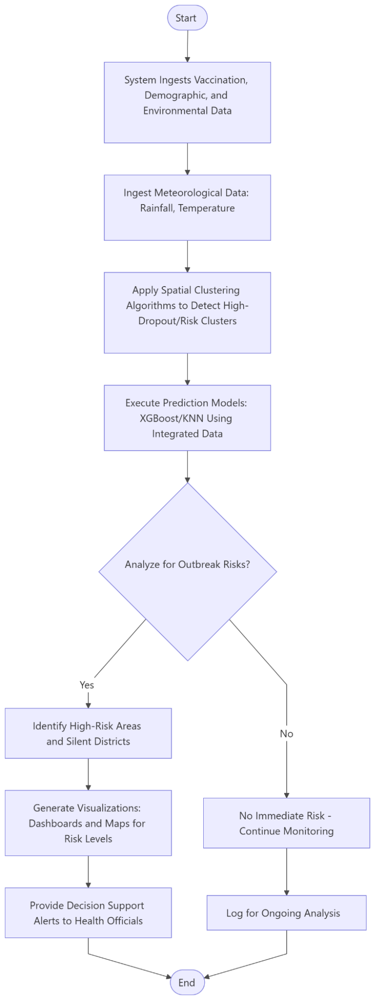

*Figure 3.18: Activity Diagram – Predictive Analytics and Decision Support*

1. Activity Diagram for Reporting and Interoperability

This diagram shows the generation, export, and exchange of reports while ensuring compliance with standards. It handles configurable reports and data interoperability with external systems. It includes functional requirements like generate reports, export in standard formats,HL7 FHIR compliance, and exchange with DHIS2. Non-functional interoperability and security (audit logging) are crucial, with mappings to FHIR resources.

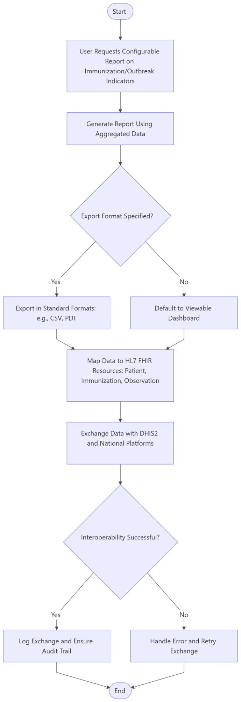

*Figure 3.19: Activity Diagram – Reporting and Interoperability*

#### 3.3.4.4 Collaboration Diagram

The Collaboration Diagram of the System illustrates how various actors, system modules, and external systems interact to achieve the core functions of the platform. Unlike a Use Case Diagram, which shows what the system does, the Collaboration Diagram emphasizes how the objects communicate to complete a process, including the sequence of messages exchanged.

This diagram highlights the interactions among:

- Human actors who initiate actions or receive notifications:

- Administrator: Manages user accounts, system configuration, and generates reports.
- Health Worker: Registers children, records vaccinations, and updates epidemiological data.
- Public Health Official: Monitors vaccination coverage, views outbreak risk maps, and analyzes reports.
- Caregiver: Receives automated reminders and alerts regarding their child’s vaccination schedule.

- System modules that process and store data:

- Patient registration Module: Registers new patient and stores demographic details.
- Vaccination Module: Manages vaccination schedules and records administered vaccines.
- Defaulter Monitoring Module: Detects children who missed scheduled vaccines.
- Outbreak Prediction & Alert Module: Predicts potential disease outbreaks and generates alerts.
- Epidemiology & Analytics Module: Aggregates health data and visualizes KPIs.
- Report Generation Modul e: Generates and exports reports.
- Notification Service: Sends reminders and alerts to caregivers.
- System Configuration & User Management Modules: Administer system settings and user accounts.

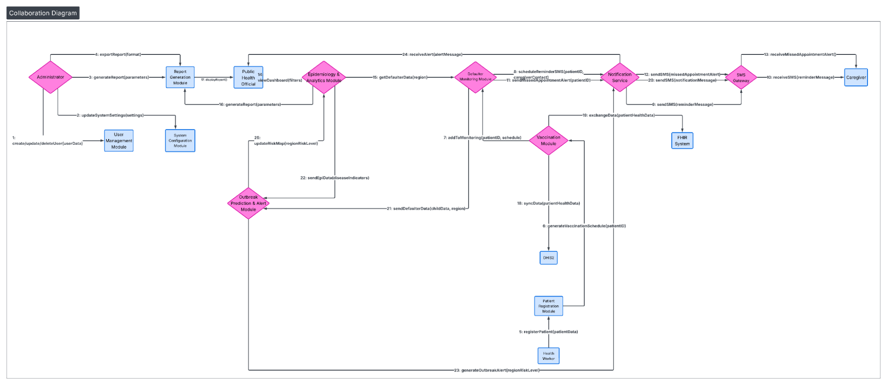
