<!-- Generated by documentation/tools/generate_chapter_drafts.py. Edit the draft file directly if you want to keep manual refinements, or update the generator and rerun it for repeatable changes. -->

# Chapter Four: System Design

This chapter presents the detailed system design of the National Vaccination and Outbreak Monitoring System (NVOMS) for Ethiopia. The design translates the validated requirements and models from Chapter Three into a structured technical solution that supports secure data capture, vaccination tracking, predictive analytics, interoperability, and scalable public health decision support.

## 4.1 Overview

System design is an important stage in the development of the proposed National Vaccination and Outbreak Monitoring System (NVOMS). In this phase, the requirements identified in Chapter Three are transformed into a structured plan that can be implemented. It describes how the system will be organized, how different components will interact, and how the required functionalities will be achieved.

The main purpose of this design is to provide a clear framework for how the system will operate. It explains how data will move between different parts of the system and how users will interact with it. Considering the challenges in Ethiopia’s public health system, such as fragmented data sources, delays in detecting outbreaks, and the existence of zero-dose populations, the system must be designed to be reliable, scalable, and suitable for real-world conditions.

In this project, a modular and service-oriented approach is used. The system is divided into different layers, including data collection, processing, analysis, and presentation. This separation makes the system easier to manage and allows future improvements to be made without affecting the entire system. It also supports the development of a Minimum Viable Product (MVP), which can be expanded later.

To improve accessibility, the system includes both web-based interfaces and SMS-based communication. This is especially important in areas where internet connectivity is limited. The design also considers integration with existing health information systems such as DHIS2 and eCHIS. Standard data exchange protocols, particularly HL7 FHIR, are used to enable smooth communication between systems and avoid duplication of data.

Another important feature of the system is the inclusion of predictive analytics. By using machine learning models and external data sources such as weather information, the system aims to support early detection of disease outbreaks and better decision-making.

Overall, this chapter presents a system design that focuses on both technical requirements and the practical conditions of the healthcare system in Ethiopia.

## 4.2 Specifying the Design Goals

The design goals of the system are based on the project objectives, user needs, and system requirements identified earlier. These goals guide the design decisions and help ensure that the system performs effectively in practice.

### 4.2.1 Performance

Performance is an important consideration because the system needs to provide timely information for decision-making. Users should be able to access data quickly, and the system should respond without significant delays.

To achieve this, efficient database queries and optimized APIs are considered in the design. In addition, some processes, such as sending SMS notifications and monitoring vaccination status, are handled in the background so that they do not affect the user experience.

### 4.2.2 Scalability

The system is expected to grow over time, from a small prototype to a larger system that may be used at a national level. For this reason, scalability is an important design goal.

The modular structure of the system allows different components to be scaled independently. For example, the database and analytics components can be expanded as the amount of data increases. Cloud-based technologies and containerization tools such as Docker can also be used to support system expansion.

### 4.2.3 Security

Since the system deals with sensitive health data, security is a major concern. Appropriate measures are included in the design to protect data from unauthorized access.

These measures include user authentication, role-based access control, and data encryption. Secure communication between system components is also considered, for example through token-based authentication methods. In addition, audit logs are used to track system activities and improve accountability.

### 4.2.4 Availability and Reliability

The system should be available whenever it is needed and should operate reliably even in challenging conditions. This is particularly important in areas with limited infrastructure.

One important feature is offline functionality, which allows users to collect data even when there is no internet connection. The data can then be synchronized when connectivity is restored. Error handling and system monitoring are also included to help detect and resolve issues quickly.

### 4.2.5 Usability

The system is designed to be easy to use, especially for health workers who may have limited technical experience. The interface should be simple and clear, allowing users to complete tasks with minimal effort.

Key features include a consistent layout, reduced data entry requirements, and visual dashboards that make information easier to understand. The system is also designed to work on different devices, including mobile phones.

### 4.2.6 Interoperability

Interoperability ensures that the system can work with other existing health information systems. This is important to avoid duplication and improve data sharing.

The use of HL7 FHIR standards allows structured and consistent data exchange between systems such as DHIS2 and eCHIS. This makes it easier to integrate the system into the current healthcare infrastructure.

### 4.2.7 Maintainability and Extensibility

The system is designed in a way that makes it easy to update and improve over time. The modular structure allows individual components to be modified without affecting the whole system.

This also makes it possible to add new features, such as additional analytics tools, in the future without major changes to the system.

### 4.2.8 Data Accuracy and Quality

Accurate data is essential for effective decision-making. The system includes validation mechanisms to reduce errors during data entry.

Features such as unique patient identifiers and automated reminders help ensure that records are complete and consistent. This helps address issues like inaccurate reporting.

### 4.2.9 Support for Predictive Analytics

The system is designed to support predictive analysis of disease outbreaks. By integrating machine learning models and external data sources, the system can identify patterns and provide early warnings.

This allows health officials to take preventive actions rather than only reacting after outbreaks occur.

## 4.3.1. Proposed Software Architecture

The system adopts a Layered Service-Oriented Architecture (SOA) that combines the modularity and reusability of SOA with the structured separation of concerns in layered (N-tier) architecture. This hybrid approach is ideal for a health information system that must support diverse users (healthcare workers, officials, caregivers), real-time operations, predictive analytics, and future integration with national systems like DHIS2.

### Architecture Overview (4-Tier Layered SOA)

*Figure 4.1: Layered Service-Oriented Architecture of the National Vaccination and Outbreak Monitoring System*
Mermaid source: [`figure-4-01-layered-service-oriented-architecture.mmd`](../assets/diagrams/mermaid/figure-4-01-layered-service-oriented-architecture.mmd)

## 4.3.2 Subsystem Decomposition

Subsystem decomposition is used to divide the National Vaccination and Outbreak Monitoring System into manageable and logically related parts. This makes the architecture easier to understand, supports focused development, and allows each major system function to be implemented, tested, and maintained independently. Based on the project report and design diagrams, the system can be decomposed into the following subsystems.

### Overview

The decomposition follows the layered service-oriented architecture shown in the design:

- Presentation Layer
- Application Layer
- Data Layer
- Integration Layer

Within these layers, the system is divided into functional subsystems that align with the use cases, sequence diagrams, state diagrams, activity diagrams, and collaboration diagram.

### Subsystems

#### 1. User Management and Security Subsystem

This subsystem manages user accounts, authentication, authorization, password recovery, and audit control.

Main responsibilities:

- create and manage role-based accounts for administrators, health workers, and public health officials
- enforce secure login and authorization rules
- support password reset and first-login password change
- lock accounts after repeated failed login attempts
- log security-sensitive activities for accountability

Main data:

- `users`
- `roles`
- `permissions`
- `role_permissions`
- `user_sessions`
- `password_reset_tokens`
- `audit_logs`

Primary actors:

- Administrator
- Health Worker
- Public Health Official

#### 2. Patient and Caregiver Registry Subsystem

This subsystem manages the registration of patients and caregivers and ensures that each patient has a unique identity in the system.

Main responsibilities:

- capture patient demographic details
- capture caregiver information
- generate and preserve a unique patient UID
- detect and review possible duplicate records
- maintain the core patient profile used by all other subsystems

Main data:

- `patients`
- `caregivers`
- `patient_duplicate_cases`
- `administrative_units`
- `health_facilities`

Primary actor:

- Health Worker

#### 3. Vaccination Scheduling and Tracking Subsystem

This subsystem is responsible for the digital immunization workflow from vaccine schedule generation to dose history maintenance.

Main responsibilities:

- store national EPI schedule versions and rules
- generate patient-specific vaccine schedules after registration
- record vaccine administration details such as batch number, route, site, and date
- maintain vaccination appointment lifecycle states such as scheduled, due, overdue, defaulter, and administered
- keep an updated vaccination history for each patient

Main data:

- `vaccine_definitions`
- `epi_schedule_versions`
- `epi_schedule_rules`
- `patient_vaccination_schedules`
- `immunization_events`
- `vaccine_batches`
- `schedule_status_events`
- `patient_immunization_status`

Primary actors:

- Health Worker
- System Scheduler

#### 4. Surveillance and Defaulter Monitoring Subsystem

This subsystem monitors clinical signals and vaccination follow-up conditions that require public health action.

Main responsibilities:

- record surveillance observations such as AFP, rash, fever, and AEFI
- flag patients requiring follow-up
- identify zero-dose children
- detect overdue and defaulter patients
- support outreach monitoring and case follow-up

Main data:

- `surveillance_reports`
- `surveillance_symptoms`
- `patient_immunization_status`
- `patient_vaccination_schedules`
- `outbreak_alerts`

Primary actors:

- Health Worker
- Public Health Official
- System Scheduler

#### 5. Notification and Reminder Subsystem

This subsystem handles all automated messaging to caregivers and supports retention in the immunization program.

Main responsibilities:

- send reminder SMS for upcoming vaccinations
- send missed-appointment alerts for overdue vaccinations
- localize messages using caregiver language preferences
- manage SMS queueing, retries, and delivery tracking
- keep notification history for each patient and caregiver

Main data:

- `message_templates`
- `sms_notifications`
- `notification_attempts`

Primary actors and external systems:

- Caregiver
- SMS Gateway
- System Scheduler

#### 6. Analytics and Dashboard Subsystem

This subsystem produces descriptive analytics for administrators and public health officials.

Main responsibilities:

- calculate coverage rates, dropout rates, zero-dose counts, and other KPIs
- aggregate data across facility, woreda, regional, and national levels
- provide dashboard-ready data for charts, indicators, and summaries
- support hotspot detection and analytical review

Main data:

- `patient_immunization_status`
- `prediction_scores`
- `defaulter_clusters`
- `generated_reports`
- `administrative_units`

Primary actors:

- Administrator
- Public Health Official

#### 7. Prediction and Outbreak Alert Subsystem

This subsystem provides predictive decision support for early outbreak detection and risk mapping.

Main responsibilities:

- ingest model-ready health and environmental features
- run outbreak prediction models such as XGBoost and KNN
- assign risk scores to administrative units
- identify high-risk areas and silent districts
- generate outbreak alerts for further verification

Main data:

- `environmental_observations`
- `model_registry`
- `prediction_runs`
- `prediction_scores`
- `defaulter_clusters`
- `outbreak_alerts`

Primary actors:

- Public Health Official
- System Analytics Engine

#### 8. Reporting and Interoperability Subsystem

This subsystem supports formal reporting and data exchange with external health platforms.

Main responsibilities:

- generate immunization and outbreak reports
- export reports in standard formats such as PDF and CSV
- map internal data to HL7 FHIR resources
- share aggregate and case-based data with DHIS2
- log exchange status, mapping errors, and import summaries

Main data:

- `report_definitions`
- `generated_reports`
- `integration_endpoints`
- `integration_jobs`
- `dhis2_sync_batches`
- `dhis2_sync_items`
- `fhir_exchange_logs`

Primary actors and external systems:

- Administrator
- Public Health Official
- DHIS2
- FHIR-based external systems

#### 9. Offline Sync Subsystem

This subsystem supports data capture in low-connectivity environments and synchronization with the central database when connectivity is restored.

Main responsibilities:

- register devices used for field data capture
- queue offline transactions
- submit sync batches to the central server
- acknowledge successful synchronization
- flag conflicts for manual resolution

Main data:

- `device_registrations`
- `sync_batches`
- `sync_batch_items`

Primary actor:

- Health Worker

#### 10. Data Management Subsystem

This subsystem provides the shared persistent data layer used by all application services.

Main responsibilities:

- enforce referential integrity and consistency
- store transactional, analytical, and integration data
- support secure storage and auditability
- maintain historical records for clinical, operational, and reporting processes

Main data stores:

- PostgreSQL database
- file storage for exported reports and external artifacts

### Subsystem Interaction Summary

The major interactions among the subsystems are as follows:

1. The User Management and Security Subsystem authenticates users before they access any other subsystem.
2. The Patient and Caregiver Registry Subsystem creates the patient record used by the Vaccination Scheduling and Tracking Subsystem.
3. The Vaccination Scheduling and Tracking Subsystem updates patient schedules and status values used by the Surveillance and Defaulter Monitoring Subsystem.
4. The Surveillance and Defaulter Monitoring Subsystem provides cases and status flags that can trigger the Notification and Reminder Subsystem and the Prediction and Outbreak Alert Subsystem.
5. The Prediction and Outbreak Alert Subsystem depends on the Analytics and Dashboard Subsystem, Environmental Data, and surveillance data to generate risk scores and alerts.
6. The Reporting and Interoperability Subsystem consumes data from the registry, vaccination, surveillance, analytics, and prediction subsystems to produce reports and exchange records with external systems.
7. The Offline Sync Subsystem connects field-level data capture with the central data layer and ensures eventual consistency.

### Summary Table

| Subsystem | Primary responsibility | Main consumers |
|---|---|---|
| User Management and Security | authentication, RBAC, password recovery, audit logging | all internal users |
| Patient and Caregiver Registry | patient identity, caregiver linkage, duplicate prevention | Health Worker, Vaccination subsystem |
| Vaccination Scheduling and Tracking | scheduling, dose recording, vaccination history | Health Worker, Notification subsystem |
| Surveillance and Defaulter Monitoring | symptom capture, zero-dose and defaulter tracking | Health Worker, Public Health Official |
| Notification and Reminder | SMS reminders and missed-dose alerts | Caregiver, Health Worker |
| Analytics and Dashboard | KPIs, aggregated indicators, hotspot analysis | Administrator, Public Health Official |
| Prediction and Outbreak Alert | outbreak prediction, risk scoring, silent district detection | Public Health Official |
| Reporting and Interoperability | reports, exports, FHIR mapping, DHIS2 exchange | Administrator, Public Health Official, external platforms |
| Offline Sync | local capture and later synchronization | Health Worker |
| Data Management | persistent storage and integrity control | all subsystems |

### Conclusion

The subsystem decomposition shows that the National Vaccination and Outbreak Monitoring System is modular, service-oriented, and suitable for phased development. Each subsystem has a clear responsibility, defined data ownership, and well-understood interactions with the others. This structure improves maintainability, scalability, and testability while also supporting the practical workflows described in the project report.

## 4.3.3 Database Design

The database design of NVOMS is derived directly from the system requirements, the use-case model, the dynamic models, the layered service-oriented architecture, and the subsystem decomposition. PostgreSQL is selected as the core data platform because it provides strong relational integrity for vaccination tracking, support for structured interoperability payloads, and extensibility for analytical and geospatial data.

### Database Design Principles

- The patient registry remains the central point of the data model so that every vaccination, surveillance observation, and notification can be tied to a uniquely identified child.
- Vaccination schedules are stored separately from actual administered doses in order to support due, overdue, defaulter, catch-up, and administered states.
- Offline synchronization, SMS notification delivery, interoperability exchange logs, and audit trails are treated as first-class data structures rather than side effects.
- Prediction outputs and analytical summaries are separated from transactional tables so that reporting and risk scoring can scale without weakening core clinical integrity.
- Administrative geography is modeled hierarchically to support dashboards, hotspot analysis, and integration with national reporting structures.

### Core Entity Groups

- Geography and facility structure: administrative units and health facilities.
- Security and administration: users, roles, permissions, sessions, reset tokens, audit logs, and settings.
- Core registry: caregivers, patients, and duplicate review records.
- Immunization engine: vaccine definitions, EPI schedule versions and rules, patient schedules, vaccine batches, dose events, and schedule status history.
- Surveillance and alerts: surveillance reports, surveillance symptoms, and outbreak alerts.
- Notifications: message templates, SMS notifications, and notification attempts.
- Prediction and analytics: environmental observations, model registry, prediction runs, prediction scores, and defaulter clusters.
- Reporting and interoperability: report definitions, generated reports, integration jobs, DHIS2 sync records, and FHIR exchange logs.
- Offline sync: device registrations, sync batches, and sync batch items.

### High-Level ER View

```mermaid
erDiagram
    ADMINISTRATIVE_UNITS ||--o{ ADMINISTRATIVE_UNITS : parent_of
    ADMINISTRATIVE_UNITS ||--o{ HEALTH_FACILITIES : contains
    ADMINISTRATIVE_UNITS ||--o{ CAREGIVERS : residence_of
    ADMINISTRATIVE_UNITS ||--o{ PATIENTS : residence_of
    ADMINISTRATIVE_UNITS ||--o{ ENVIRONMENTAL_OBSERVATIONS : observed_for
    ADMINISTRATIVE_UNITS ||--o{ PREDICTION_SCORES : scored_for
    ADMINISTRATIVE_UNITS ||--o{ OUTBREAK_ALERTS : raised_for

    ROLES ||--o{ USERS : assigned_to
    ROLES ||--o{ ROLE_PERMISSIONS : grants
    PERMISSIONS ||--o{ ROLE_PERMISSIONS : contains
    USERS ||--o{ USER_SESSIONS : opens
    USERS ||--o{ AUDIT_LOGS : performs
    USERS ||--o{ PATIENTS : registers
    USERS ||--o{ IMMUNIZATION_EVENTS : records
    USERS ||--o{ SURVEILLANCE_REPORTS : records
    USERS ||--o{ GENERATED_REPORTS : requests

    CAREGIVERS ||--o{ PATIENTS : primary_contact_for
    PATIENTS ||--o{ PATIENT_DUPLICATE_CASES : reviewed_as_candidate
    PATIENTS ||--o{ PATIENT_VACCINATION_SCHEDULES : has
    PATIENTS ||--o{ IMMUNIZATION_EVENTS : receives
    PATIENTS ||--o{ SURVEILLANCE_REPORTS : has
    PATIENTS ||--|| PATIENT_IMMUNIZATION_STATUS : summarized_by

    VACCINE_DEFINITIONS ||--o{ EPI_SCHEDULE_RULES : scheduled_by
    EPI_SCHEDULE_VERSIONS ||--o{ EPI_SCHEDULE_RULES : contains
    EPI_SCHEDULE_RULES ||--o{ PATIENT_VACCINATION_SCHEDULES : generates
    VACCINE_DEFINITIONS ||--o{ VACCINE_BATCHES : identifies
    VACCINE_BATCHES ||--o{ IMMUNIZATION_EVENTS : used_in
    PATIENT_VACCINATION_SCHEDULES ||--o{ IMMUNIZATION_EVENTS : fulfilled_by
    PATIENT_VACCINATION_SCHEDULES ||--o{ SCHEDULE_STATUS_EVENTS : changes_through

    SURVEILLANCE_REPORTS ||--o{ SURVEILLANCE_SYMPTOMS : details
    SURVEILLANCE_REPORTS ||--o{ OUTBREAK_ALERTS : may_trigger

    MESSAGE_TEMPLATES ||--o{ SMS_NOTIFICATIONS : formats
    CAREGIVERS ||--o{ SMS_NOTIFICATIONS : receives
    PATIENTS ||--o{ SMS_NOTIFICATIONS : concerns
    PATIENT_VACCINATION_SCHEDULES ||--o{ SMS_NOTIFICATIONS : reminds
    SMS_NOTIFICATIONS ||--o{ NOTIFICATION_ATTEMPTS : retried_as

    MODEL_REGISTRY ||--o{ PREDICTION_RUNS : executes
    PREDICTION_RUNS ||--o{ PREDICTION_SCORES : produces
    PREDICTION_SCORES ||--o{ OUTBREAK_ALERTS : escalates_to
    PREDICTION_RUNS ||--o{ DEFAULTER_CLUSTERS : finds

    INTEGRATION_ENDPOINTS ||--o{ INTEGRATION_JOBS : used_by
    INTEGRATION_JOBS ||--o{ DHIS2_SYNC_BATCHES : tracks
    DHIS2_SYNC_BATCHES ||--o{ DHIS2_SYNC_ITEMS : contains
    INTEGRATION_JOBS ||--o{ FHIR_EXCHANGE_LOGS : logs

    DEVICE_REGISTRATIONS ||--o{ SYNC_BATCHES : uploads
    SYNC_BATCHES ||--o{ SYNC_BATCH_ITEMS : contains
```

### Database Design Artifacts

- Narrative database design: [NVOMS_DATABASE_DESIGN.md](04-database-design/NVOMS_DATABASE_DESIGN.md)
- Implementation-ready PostgreSQL schema: [NVOMS_POSTGRESQL_SCHEMA.sql](04-database-design/NVOMS_POSTGRESQL_SCHEMA.sql)
- Diagram-oriented DBML schema: [NVOMS_SCHEMA_DBML.dbml](04-database-design/NVOMS_SCHEMA_DBML.dbml)
- Functional-requirements traceability: [NVOMS_REQUIREMENTS_VERIFICATION.md](04-database-design/NVOMS_REQUIREMENTS_VERIFICATION.md)

## 4.4 Design Verification

The design was reviewed against the functional and non-functional requirements identified in Chapter Three. The resulting architecture and database structure support secure role-based access, atomic patient and caregiver registration, vaccination schedule generation, offline data capture and synchronization, SMS-based reminders, predictive analytics, interoperability with DHIS2 through FHIR-aligned mappings, and auditable reporting workflows. The design therefore satisfies the main operational needs of the proposed NVOMS prototype while remaining extensible for future national-scale deployment.
