# National Vaccination and Outbreak Monitoring System

## Database Design Basis

This database design is based on a close reading of the project report and the embedded design figures in the DOCX. The image mapping in the report shows that the design is organized around these major modules and workflows:

- User Management and Security
- Patient and Caregiver Registration
- Immunization and Surveillance Management
- Notifications and Alerts
- Predictive Analytics and Decision Support
- Reporting and Interoperability
- A 4-tier layered SOA with five main services:
  User Management Service, Vaccination Tracking Service, Notification Service, Analytics Service, and Prediction Service

The schema below is designed to support those divisions directly instead of treating the project like a generic hospital system.

## Key Findings From The Design Images

The provided images made a few design decisions much clearer:

- `image23.png` confirms the final actor and use-case boundary:
  Administrator, Health Worker, Caregiver, SMS Gateway, DHIS2, and Public Health Official
- `image8.png` confirms the layered architecture:
  Presentation, Application, Data, and Integration layers, with PostgreSQL plus file storage in the data layer
- `image15.png` confirms the collaboration modules:
  Patient Registration, Vaccination, Defaulter Monitoring, Epidemiology and Analytics, Outbreak Prediction and Alert, Notification, Reporting, User Management, and System Configuration
- `image14.png` confirms patient registration is atomic:
  duplicate check, UID generation, caregiver insert, patient insert, then vaccination history initialization
- `image9.png` confirms the vaccine appointment lifecycle:
  `scheduled -> due -> overdue -> defaulter -> administered -> stored locally -> synced`
- `image11.png` and `image7.png` confirm the user lifecycle needs:
  inactive account creation, first-login password change, account locking, and password reset token flow
- `image20.png` confirms the risk map returns GeoJSON-like boundary data and explicitly tags silent districts
- `image22.png` confirms reminders and missed-appointment alerts are daily batch operations with localization and retry logging

## Recommended Platform

PostgreSQL is the best fit for this project because it handles:

- strong relational integrity for vaccination history and caregiver links
- JSONB for FHIR payloads, integration logs, and model outputs
- time-series style operational data such as weather ingestion and sync jobs
- future spatial extensions with PostGIS for risk maps and hotspot analysis

Note:
The report excludes full vaccine logistics management, so the schema includes `vaccine_batches` only as a reference table for dose validation, not as a stock or cold-chain module.

## Design Principles

1. Keep the patient registry central because the report is trying to solve phantom coverage and zero-dose tracking.
2. Separate schedule records from actual administered doses because the diagrams clearly model dose lifecycle and defaulter status over time.
3. Store operational data for SMS, offline sync, interoperability, and audit logging as first-class tables.
4. Keep analytics and prediction outputs in their own tables so dashboards and risk maps do not overload transactional tables.
5. Model geography hierarchically because dashboards, risk maps, and reporting all aggregate by Region, Woreda, and Kebele.

## Subsystem-to-Database Mapping

| Subsystem / Service | Database responsibility |
|---|---|
| User Management Service | `roles`, `permissions`, `users`, `user_sessions`, `password_reset_tokens`, `audit_logs`, `system_settings` |
| Vaccination Tracking Service | `caregivers`, `patients`, `patient_duplicate_cases`, `vaccine_definitions`, `epi_schedule_versions`, `epi_schedule_rules`, `patient_vaccination_schedules`, `immunization_events`, `vaccine_batches`, `patient_immunization_status` |
| Notification Service | `message_templates`, `sms_notifications`, `notification_attempts` |
| Analytics Service | `patient_immunization_status`, `environmental_observations`, `defaulter_clusters`, `generated_reports` |
| Prediction Service | `model_registry`, `prediction_runs`, `prediction_scores`, `outbreak_alerts` |
| Reporting / Interoperability | `integration_endpoints`, `integration_jobs`, `dhis2_sync_batches`, `dhis2_sync_items`, `fhir_exchange_logs`, `report_definitions`, `generated_reports` |
| Offline-first support | `device_registrations`, `sync_batches`, `sync_batch_items` |
| Shared reference data | `administrative_units`, `health_facilities` |

## Core Entity Groups

### 1. Geography and Facility Structure

These tables support national-to-local rollups and risk maps.

- `administrative_units`
  Stores the hierarchy `country -> region -> zone -> woreda -> kebele`, plus optional boundary GeoJSON for map rendering.
- `health_facilities`
  Stores health centers, hospitals, and posts attached to the administrative hierarchy.

This structure supports:

- national dashboard aggregation
- woreda and kebele hotspot analysis
- facility-level service delivery and reporting
- DHIS2 org-unit mapping

### 2. Security and Administration

- `roles`
- `permissions`
- `role_permissions`
- `users`
- `user_sessions`
- `password_reset_tokens`
- `audit_logs`
- `system_settings`

This group supports RBAC, login lifecycle, first-login password change, account locking, password recovery, JWT session tracking, admin configuration, and auditability.

### 3. Core Registry

- `caregivers`
- `patients`
- `patient_duplicate_cases`

Important design choice:
`patients.primary_caregiver_id` is mandatory. This reflects the report's design image description that the patient and caregiver are committed together and that a patient should not exist without a linked caregiver.

### 4. Immunization Engine

- `vaccine_definitions`
- `epi_schedule_versions`
- `epi_schedule_rules`
- `patient_vaccination_schedules`
- `vaccine_batches`
- `immunization_events`
- `schedule_status_events`
- `patient_immunization_status`

This separation is important:

- `epi_schedule_rules` stores the national EPI rules
- `patient_vaccination_schedules` stores patient-specific future appointments generated from DOB
- `immunization_events` stores what was actually administered
- `schedule_status_events` preserves the scheduled -> due -> overdue -> defaulter progression described in the state diagrams
- `patient_immunization_status` gives a fast daily summary for dashboards, reminders, and outreach lists

### 5. Surveillance and Alerts

- `surveillance_reports`
- `surveillance_symptoms`
- `outbreak_alerts`

This covers both:

- adverse events following immunization
- disease surveillance signals such as AFP, rash, and fever

### 6. Notifications

- `message_templates`
- `sms_notifications`
- `notification_attempts`

These tables support localized reminder messages, missed-appointment alerts, delivery retries, and gateway response logging.

### 7. Prediction and Analytics

- `environmental_observations`
- `model_registry`
- `prediction_runs`
- `prediction_scores`
- `defaulter_clusters`

This design keeps model inputs and outputs separate from the operational registry so analytics can scale independently.

### 8. Reporting, DHIS2, and FHIR Interoperability

- `report_definitions`
- `generated_reports`
- `integration_endpoints`
- `integration_jobs`
- `dhis2_sync_batches`
- `dhis2_sync_items`
- `fhir_exchange_logs`

This directly matches the reporting and interoperability sequence and state models in the report.

### 9. Offline Sync

- `device_registrations`
- `sync_batches`
- `sync_batch_items`

These tables support the offline-first design shown in the immunization workflow and sync use case.

## High-Level ER View

```mermaid
erDiagram
    ADMINISTRATIVE_UNITS ||--o{ ADMINISTRATIVE_UNITS : parent_of
    ADMINISTRATIVE_UNITS ||--o{ HEALTH_FACILITIES : contains
    ADMINISTRATIVE_UNITS ||--o{ CAREGIVERS : residence_of
    ADMINISTRATIVE_UNITS ||--o{ PATIENTS : residence_of
    ADMINISTRATIVE_UNITS ||--o{ ENVIRONMENTAL_OBSERVATIONS : observed_for
    ADMINISTRATIVE_UNITS ||--o{ PREDICTION_SCORES : scored_for
    ADMINISTRATIVE_UNITS ||--o{ OUTBREAK_ALERTS : raised_for

    ROLES ||--o{ USERS : assigned_to
    ROLES ||--o{ ROLE_PERMISSIONS : grants
    PERMISSIONS ||--o{ ROLE_PERMISSIONS : contains
    USERS ||--o{ USER_SESSIONS : opens
    USERS ||--o{ AUDIT_LOGS : performs
    USERS ||--o{ PATIENTS : registers
    USERS ||--o{ IMMUNIZATION_EVENTS : records
    USERS ||--o{ SURVEILLANCE_REPORTS : records
    USERS ||--o{ GENERATED_REPORTS : requests

    CAREGIVERS ||--o{ PATIENTS : primary_contact_for
    PATIENTS ||--o{ PATIENT_DUPLICATE_CASES : reviewed_as_candidate
    PATIENTS ||--o{ PATIENT_VACCINATION_SCHEDULES : has
    PATIENTS ||--o{ IMMUNIZATION_EVENTS : receives
    PATIENTS ||--o{ SURVEILLANCE_REPORTS : has
    PATIENTS ||--|| PATIENT_IMMUNIZATION_STATUS : summarized_by

    VACCINE_DEFINITIONS ||--o{ EPI_SCHEDULE_RULES : scheduled_by
    EPI_SCHEDULE_VERSIONS ||--o{ EPI_SCHEDULE_RULES : contains
    EPI_SCHEDULE_RULES ||--o{ PATIENT_VACCINATION_SCHEDULES : generates
    VACCINE_DEFINITIONS ||--o{ VACCINE_BATCHES : identifies
    VACCINE_BATCHES ||--o{ IMMUNIZATION_EVENTS : used_in
    PATIENT_VACCINATION_SCHEDULES ||--o{ IMMUNIZATION_EVENTS : fulfilled_by
    PATIENT_VACCINATION_SCHEDULES ||--o{ SCHEDULE_STATUS_EVENTS : changes_through

    SURVEILLANCE_REPORTS ||--o{ SURVEILLANCE_SYMPTOMS : details
    SURVEILLANCE_REPORTS ||--o{ OUTBREAK_ALERTS : may_trigger

    MESSAGE_TEMPLATES ||--o{ SMS_NOTIFICATIONS : formats
    CAREGIVERS ||--o{ SMS_NOTIFICATIONS : receives
    PATIENTS ||--o{ SMS_NOTIFICATIONS : concerns
    PATIENT_VACCINATION_SCHEDULES ||--o{ SMS_NOTIFICATIONS : reminds
    SMS_NOTIFICATIONS ||--o{ NOTIFICATION_ATTEMPTS : retried_as

    MODEL_REGISTRY ||--o{ PREDICTION_RUNS : executes
    PREDICTION_RUNS ||--o{ PREDICTION_SCORES : produces
    PREDICTION_SCORES ||--o{ OUTBREAK_ALERTS : escalates_to
    PREDICTION_RUNS ||--o{ DEFAULTER_CLUSTERS : finds

    INTEGRATION_ENDPOINTS ||--o{ INTEGRATION_JOBS : used_by
    INTEGRATION_JOBS ||--o{ DHIS2_SYNC_BATCHES : tracks
    DHIS2_SYNC_BATCHES ||--o{ DHIS2_SYNC_ITEMS : contains
    INTEGRATION_JOBS ||--o{ FHIR_EXCHANGE_LOGS : logs

    DEVICE_REGISTRATIONS ||--o{ SYNC_BATCHES : uploads
    SYNC_BATCHES ||--o{ SYNC_BATCH_ITEMS : contains
```

## Main Business Rules

1. Every patient must have a primary caregiver.
2. Every patient must have a unique persistent UID.
3. A schedule rule belongs to one EPI schedule version.
4. A patient schedule row represents one due dose for one patient.
5. A dose event may fulfill a schedule row, but catch-up doses are still allowed.
6. Zero-dose status is derived from the absence of administered immunization events and stored in `patient_immunization_status` for performance.
7. Defaulter status is derived from schedule delay thresholds and recorded both in the schedule table and in status history.
8. Weather data is stored by administrative unit and timestamp so prediction runs can build consistent feature windows.
9. Outbreak alerts may come from prediction output, surveillance reports, or manual escalation.
10. FHIR and DHIS2 exchange logs must be auditable independently from clinical tables.
11. New users should be forced to change temporary credentials on first login.
12. Administrative units may carry boundary GeoJSON so the risk map can return district shapes instead of only coordinates.

## Important Constraints and Indexing Strategy

The SQL file includes indexes for these critical operations:

- patient search by UID
- patient search through caregiver phone
- due / overdue / defaulter schedule scans
- immunization history retrieval by patient and date
- recent surveillance signals by location and condition
- weather lookup by woreda and observation time
- risk-map lookup by district and disease
- queued SMS dispatch and retry polling
- sync batch processing and conflict review
- audit trail lookup by entity and subsystem

## Design Decisions Made Carefully From the Report

### Patient and caregiver are separate entities

The report treats the caregiver as an important contact actor, not just a text field. The database therefore gives the caregiver its own table.

### Schedule and actual vaccination are not the same thing

The state diagram for vaccination appointments and the use cases make this distinction very clear, so the schema keeps:

- due appointments in `patient_vaccination_schedules`
- actual dose administration in `immunization_events`

### Offline support needs server-side traceability

Because the design explicitly includes IndexedDB, pending sync, ACK responses, and manual conflict review, the schema includes sync batches and sync items instead of assuming sync is only a client concern.

### Prediction output is stored, not recomputed on every dashboard load

The report describes scheduled daily or on-demand runs and risk map rendering. Persisting `prediction_runs` and `prediction_scores` makes dashboards, verification, and alert history reliable.

### Interoperability is treated as a subsystem

FHIR exchange and DHIS2 sharing are not side notes in the report; they are explicit use cases. That is why integration logs and batch tables are included.

## Known Assumptions

1. The schema uses one generic administrative hierarchy table instead of separate region, woreda, and kebele tables.
2. The schema assumes one mandatory primary caregiver per patient.
3. Full inventory and cold-chain management are intentionally excluded.
4. FHIR resources are generated from internal tables and the exchanged payloads are logged, rather than storing the whole system natively as FHIR-first.
5. Boundary GeoJSON can be stored directly in the database at prototype stage and later migrated to PostGIS geometry if the project grows.

## Suggested Next Step

The SQL design in `postgresql-schema.sql` is ready to use as the logical schema baseline for implementation, ERD drawing, or chapter-four database documentation.
