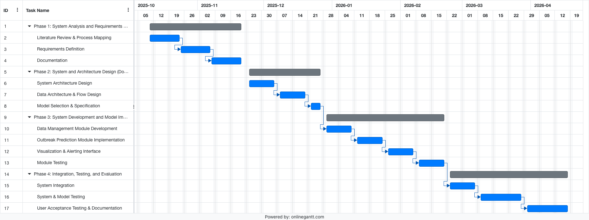
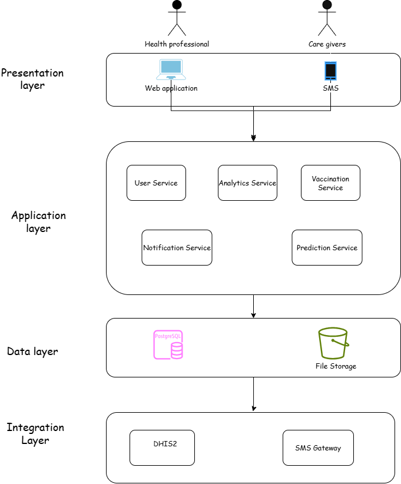

<!-- Reconstructed from dissected report files. Regenerate with documentation/tools/assemble_report.py. -->

# National Vaccination and Outbreak Monitoring System for Ethiopia

Addis Ababa Science and Technology University

College of Engineering

Department of Software Engineering

Title: National Vaccination and Outbreak Monitoring System for Ethiopia

Group Members:

| No | Name | ID |
| --- | --- | --- |
| 1 | Enkutatash Eshetu | 0533/14 |
| 2 | Rediet Yemane | 1345/14 |
| 3 | Samson Demessie | 1410/14 |
| 4 | Sefina Kamile | 1448/14 |
| 5 | Solomon Abate | 1496/14 |

Advisor Name: Ms Lelise D. Signature _________

# Acknowledgement

We would like to express our sincere appreciation to our advisor, Ms. Lelise Daniel, for her dedicated supervision, professional guidance, and constructive feedback throughout the development of this research. Her thoughtful direction, academic insight, and consistent support were instrumental in helping us refine our ideas, strengthen the methodological approach, and maintain a high level of academic rigor. Her guidance greatly contributed to shaping the scope, clarity, and overall quality of this research work.

We are also grateful to Addis Ababa Science and Technology University for providing a supportive academic environment, institutional backing, and valuable learning opportunities necessary to undertake this research. The university’s academic programs, access to learning resources, and exposure to practical and theoretical knowledge played a significant role in building the foundation required to successfully conduct this study.

We would like to acknowledge our peers, colleagues, and families for their encouragement, constructive discussions, and continuous support throughout the research process. Their feedback, cooperation, and motivation were invaluable in overcoming challenges encountered during the study and contributed positively to the successful completion of this research.

# Table of Contents

Acknowledgement 2

List of Tables 5

List of Figures 6

List of Abbreviations 7

Abstract 8

Chapter One: Introduction 1

1.1 Statement of the problem 1

1.2 Objectives 2

1.2.1 General Objective 2

1.2.2 Specific Objectives 2

1.3 Scope and Limitation 3

1.3.1 Scope 3

1.3.2 Limitations 3

1.4 Methodology 4

1.5 Plan of activities 8

1.6 Budget required 8

1.7 Significance of the Study 9

1.8. Outline of the Study 10

Chapter Two: Literature Review 11

2.1. Study Related Works 11

A. Vaccination Information Systems (VIS) in Low-Resource Settings 11

B. Epidemic Prediction Methodologies 12

C. The Role of Interoperability Standards (HL7 FHIR) 13

2.2. Identifying Milestones of the Related Literatures and Finding the Gaps 14

2.3. Lessons Learned from Literatures 15

Chapter Three: Problem Analysis and Modeling 17

3.0 Overview 17

3.1 Existing System and Its Problems 17

3.1.1 Description of the Existing Vaccination and Surveillance System 17

3.1.2 Key Stakeholders of the Existing System 18

3.1.3 Problems Identified in the Existing System 18

3.1.4 Impacts of the Identified Problems 19

3.2 Specifying the Requirements of the Proposed Solution 19

3.2.1 Requirement Elicitation Techniques 19

3.2.2 Summary of Stakeholder Needs 19

3.3 System Modeling 20

3.3.1 Functional Requirements 20

3.3.2 Non-Functional Requirements 22

3.3.3 Use Case Modeling 22

3.3.3.1. Actor Identification 22

3.3.3.2. Use Case Identification 23

3.3.3.3 Use Case Description 25

3.3.3.4. Use Case Diagram 43

3.3.4 Dynamic Models of the System 43

3.3.4.1 Sequence Diagram 43

3.3.4.2 State Machine Diagram 50

3.3.4.3 Activity Diagram 56

1. Activity Diagram for User Management and Security 56

3.3.4.4 Collaboration Diagram 62

3.5 Model Validation 63

3.5.1 Validation with Stakeholders 63

3.5.2 Consistency and Completeness Verification 64

CHAPTER FOUR: System Design 66

4.1 Overview 66

4.2. Specifying the Design Goals 66

4.3. System Design 67

4.3.1. Proposed Software Architecture 67

A. Architecture Overview (4-Tier Layered SOA) 68

4.3.2 SubSystem Decomposition 69

References 70

# List of Tables

*Table 1.1: Cost breakdown of the Project*

*Table 3.1: System Use Cases and their Descriptions*

*Table 3.2: Authenticate User Use Case Description*

*Table 3.3: Manage User Accounts Use Case Description*

*Table 3.4: Configure System Settings Use Case Description*

*Table 3.5: Register Patient Use Case Description*

*Table 3.6: View Immunization Record Use Case Description*

*Table 3.7: Record Vaccine Administration Use Case Description*

*Table 3.8: Record Surveillance Data Use Case Description*

*Table 3.9: View Analytics Dashboard Use Case Description*

*Table 3.10: View Outbreak Risk Map Use Case Description*

*Table 3.11: Generate and Export Reports Use Case Description*

*Table 3.12: Generate Vaccination Schedule Use Case Description*

*Table 3.13: Sync Offline Data Use Case Description*

*Table 3.14: Monitor Vaccination Status Use Case Description*

*Table 3.15: Identify Defaulters Use Case Description*

*Table 3.16: Send Reminder SMS Use Case Description*

*Table 3.17: Send Missed Appointment Alert Use Case Description*

*Table 3.18: Detect High Defaulter Clusters Use Case Description*

*Table 3.19: Predict Disease Outbreak Use Case Description*

*Table 3.20: Ingest Meteorological Data Use Case Description*

*Table 3.21: Share Data with DHIS2 Use Case Description*

*Table 3.22: Exchange Data via FHIR Use Case Description*

# List of Figures

*Figure 3.1: Use Case Diagram of the National Vaccination and Outbreak Monitoring System*

*Figure 3.2: Sequence Diagram – User Management and Security*

*Figure 3.3: Sequence Diagram – Patient and Caregiver Registration*

*Figure 3.4: Sequence Diagram – Immunization and Surveillance Management*

*Figure 3.5: Sequence Diagram – Notifications and Alerts*

*Figure 3.6: Sequence Diagram – Predictive Analytics and Decision Support*

*Figure 3.7: Sequence Diagram – Reporting and Interoperability*

*Figure 3.8: State Machine Diagram – User Account Lifecycle*

*Figure 3.9: State Machine Diagram – Patient Registration Flow*

*Figure 3.10: State Machine Diagram – Vaccination Appointment Lifecycle*

*Figure 3.11: State Machine Diagram – SMS Notification Flow*

*Figure 3.12: State Machine Diagram – Outbreak Alert Logic*

*Figure 3.13: State Machine Diagram – Data Export and Interoperability Flow*

*Figure 3.14: Activity Diagram – User Management and Security*

*Figure 3.15: Activity Diagram – Patient and Caregiver Registration*

*Figure 3.16: Activity Diagram – Immunization and Surveillance Management*

*Figure 3.17: Activity Diagram – Notifications and Alerts*

*Figure 3.18: Activity Diagram – Predictive Analytics and Decision Support*

*Figure 3.19: Activity Diagram – Reporting and Interoperability*

*Figure 3.20: Collaboration Diagram of the National Vaccination and Outbreak Monitoring System*

*Figure 4.1: Layered Service-Oriented Architecture of the National Vaccination and Outbreak Monitoring System*

# List of Abbreviations

API – Application Programming Interface CSV – Comma-Separated Values DBSCAN – Density-Based Spatial Clustering of Applications with Noise DHIS2 – District Health Information Software 2 EHR – Electronic Health Record EMR – Electronic Medical Record EPI – Expanded Programme on Immunization FHIR – Fast Healthcare Interoperability Resources GSM – Global System for Mobile Communications HEW – Health Extension Worker HL7 – Health Level Seven JSON – JavaScript Object Notation JWT – JSON Web Token KNN – K-Nearest Neighbor ML – Machine Learning NVOMS – National Vaccination and Outbreak Monitoring System PDF – Portable Document Format RBAC – Role-Based Access Control REST – Representational State Transfer SMS – Short Message Service SOA – Service-Oriented Architecture UID – Unique Identifier UI – User Interface WHO – World Health Organization XGBoost – Extreme Gradient Boosting

# Abstract

The public health landscape of Ethiopia is currently challenged by a "polycrisis" characterized by the convergence of climate change induced natural disasters, internal conflict, and the re-emergence of infectious diseases, specifically Measles, Cholera, and Circulating Vaccine-Derived Poliovirus type 2 (cVDPV2). Despite the implementation of digital systems such as the District Health Information Software 2 (DHIS2) and the electronic Community Health Information System (eCHIS), critical systemic gaps remain. These include data fragmentation across non-interoperable platforms, significant latency in outbreak detection, and the "phantom coverage" phenomenon where administrative reports mask high numbers of zero-dose children. This project proposes the design and development of a "National Vaccination and Outbreak Monitoring System," a centralized, interoperable platform designed to bridge these specific gaps. The study aims to transition surveillance from a reactive response model to a predictive monitoring framework. By leveraging machine learning algorithms, specifically K-Nearest Neighbors (KNN) and eXtreme Gradient Boosting (XGBoost), and integrating meteorological data with health records, the system is designed to predict outbreak risks for Measles and Cholera before they escalate into epidemics. The system architecture strictly adheres to Health Level Seven (HL7) Fast Healthcare Interoperability Resources (FHIR) standards to ensure seamless interoperability with the national DHIS2 infrastructure and utilizes automated Short Message Service (SMS) notifications to address the latency in reporting and follow-up. The research methodology involves a prototype development approach, utilizing retrospective datasets to train predictive models and simulating real-time data flows for high-burden regions such as Oromia and Somali. The significance of this work lies in its potential to drastically reduce morbidity and mortality through early warning and targeted intervention. By identifying "silent districts" and specific dropout clusters, the system enables the efficient pre-positioning of resources. Ultimately, this report outlines the development of a decision-support tool that empowers health managers to visualize risk in real-time, moving the Ethiopian health sector closer to its "Information Revolution" goals.

# Chapter One: Introduction

The public health landscape of Ethiopia is at a critical inflection point. As the second most populous nation in Africa, with a population projected to exceed 132 million in 2024, Ethiopia has made significant strides in expanding primary healthcare through its Health Extension Program (HEP) [1]. This program has been instrumental in reducing under-five mortality and improving maternal health. However, the resilience of this system is currently being tested by a "polycrisis" of converging threats: climate change driving droughts and floods, internal conflict leading to displacement, and the persistent burden of vaccine-preventable diseases (VPDs) [1], [10].

The Ethiopian Ministry of Health (MoH) has responded with an ambitious "Information Revolution" agenda, outlined in the Health Sector Transformation Plan II (HSTP-II), which seeks to transition the sector from fragmented paper-based reporting to a unified, data-driven ecosystem [1], [2]. Central to this transformation is the deployment of the District Health Information Software 2 (DHIS2) for aggregate reporting and the electronic Community Health Information System (eCHIS) for community-level data [2], [4].

Despite these advancements, the operational reality on the ground remains fraught with challenges. Recent years have witnessed simultaneous and explosive outbreaks of Measles, Cholera, and Polio (cVDPV2), which are symptomatic of deep-seated fissures in the surveillance architecture [3]. The current system struggles with "phantom coverage," a phenomenon where administrative data reports high vaccination rates while susceptible populations accumulate unnoticed [3]. Furthermore, there is significant latency in outbreak detection, where the signal of an epidemic often arrives too late for effective containment [1], [3].

This project, the "National Vaccination and Outbreak Monitoring System," is proposed as a technological intervention to bridge these specific gaps. It is designed as an active, intelligent monitoring layer that fuses disparate data streams including vaccination records, climate data, and surveillance signals to predict and detect outbreaks with greater speed and precision than currently possible.

# 1.1 Statement of the problem

Ethiopia's immunization and surveillance systems are currently trapped in a cycle of reactive response. While the national policy framework is robust, the mechanisms for data capture, analysis, and utilization suffer from critical systemic failures [1]. Ethiopia continues to face low vaccination coverage, fragmented paper-based record-keeping, and delayed outbreak detection, underscoring the urgent need for a centralized digital system that enables real-time vaccination data management, predictive outbreak monitoring, and effective citizen engagement to strengthen national immunization efforts [2].

The problem is defined by four interconnected dimensions that this study seeks to address:

1. The "Zero-Dose" and Data Quality Crisis Administrative reports often indicate vaccination coverage exceeding 90% in certain districts, yet these same areas experience explosive measles outbreaks. Root cause analyses reveal that nearly half of confirmed measles cases are "zero-dose" children who have never received a single vaccine dose [3]. Approximately 1.1 million children in Ethiopia are estimated to be zero-dose, making the country one of the top contributors to the global zero-dose burden [10]. This discrepancy is driven by "phantom coverage," where the lack of a digital registry tracking unique identities allows administrative errors and population denominator issues to mask the true risk. Without individual-level tracking, the health system cannot verify whether the reported coverage matches the actual immunity on the ground [3].

2. Latency in Outbreak Detection Reliance on paper-based reporting introduces dangerous delays in the transmission of surveillance data. For epidemic-prone diseases like cholera, detection consistently lags behind environmental triggers such as rainfall spikes and temperature anomalies [1]. In many cases, the health system is forced into emergency response mode after an outbreak has already established transmission, rather than engaging in anticipatory prevention based on early warning signals. This latency translates directly into increased morbidity and mortality [1], [6].

3. Fragmented Digital Ecosystem The national Health Management Information System (HMIS), running on DHIS2, operates largely as an aggregate reporting tool disconnected from the point-of-care. Conversely, the eCHIS aims to digitize community data but suffers from infrastructure maturity issues and lacks robust interoperability with the broader health architecture [4]. This fragmentation forces health workers into "dual reporting," where they must record data in both digital systems and paper registers. This increases the workload on already overburdened staff and paradoxically reduces data quality as workers prioritize clinical care over redundant data entry [5].

4. The "Silent District" Phenomenon The resurgence of Polio (cVDPV2) highlights the existence of surveillance blind spots, often referred to as "silent districts." These are typically conflict-affected or pastoralist areas where the absence of reported cases is often misinterpreted as the absence of disease rather than the absence of surveillance [10]. Current systems lack the predictive capability to estimate risk in these areas based on proxy indicators like population movement or adjacent district transmission, leaving the country vulnerable to undetected circulation of pathogens.

# 1.2 Objectives

### 1.2.1 General Objective

The primary objective is to develop a functional, web- and SMS-based National Vaccination and Outbreak Monitoring System that centralizes vaccination data, improves real-time reporting, and enhances outbreak prediction and response in Ethiopia [1], [2]. This project aims to design and develop a comprehensive, interoperable platform that centralizes individual-level immunization data, automates real-time reporting, and integrates predictive analytics to enhance the early detection and management of Measles, Cholera, and Polio outbreaks [3].

### 1.2.2 Specific Objectives

The specific objectives of this study are structured to address the identified problems:

- To design and implement a secure, scalable, and interoperable system for managing vaccination data across healthcare facilities. This involves creating a digital infrastructure that aligns with the HL7 FHIR standard for data exchange, ensuring compatibility with existing national systems like DHIS2 and eCHIS [4], [9].
- To digitize vaccination records and automate scheduling via SMS notifications for caregivers. This objective aims to improve vaccine attendance, reduce dropout rates, and engage parents directly in the immunization process [5].
- To provide health officials with real-time dashboards and analytics tools for monitoring vaccination coverage and identifying at-risk regions. This includes specific visualizations for "silent districts" and areas of high dropout to facilitate targeted interventions [1], [4].
- To integrate predictive models for early detection of potential disease outbreaks using vaccination and epidemiological data. This involves:

- Implementing Machine Learning (ML) algorithms, specifically K-Nearest Neighbors (KNN) and eXtreme Gradient Boosting (XGBoost), utilizing dropout rates and malnutrition data to forecast high-risk woredas for Measles [6], [7], [8].
- Integrating meteorological APIs to detect environmental precursors, such as rainfall and temperature anomalies, for Cholera prediction [1].
- Incorporating risk modeling that accounts for surveillance "silent areas" and population movement for Polio (cVDPV2) [10].

- To evaluate the system's usability and effectiveness through testing and feedback from healthcare professionals, ensuring that the solution is contextually appropriate for the Ethiopian health workforce [5].

# 1.3 Scope and Limitation

### 1.3.1 Scope

This project focuses on the design and development of a National Vaccination and Outbreak Monitoring System tailored for Ethiopia’s public health context. The system aims to digitalize vaccination records, enable real-time monitoring, and provide predictive outbreak insights. The main features include:

- Registration and digital vaccination tracking for children following the Ethiopian immunization schedule.
- Real-time data visualization dashboards for health officials to monitor vaccination coverage and identify risk areas.
- Automated SMS reminders for parents and caregivers to improve vaccine attendance.
- Integration of predictive analytics to identify potential outbreaks based on vaccination trends and demographic data.
- Role-based access for healthcare workers, administrators, and public health officials.

### 1.3.2 Limitations

- Deployment Scope: The project will not include nationwide deployment or integration with the production environment of the existing Health Management Information System (HMIS) due to resource and data access limitations. Instead, it serves as a proof-of-concept adhering to the principles of a "Minimum Viable Product" (MVP) for phased scale-up [5].
- Logistics Management: The system will not manage vaccine inventory, cold chain logistics, or supply chain tracking, focusing instead on immunization coverage, "zero-dose" tracking, and disease surveillance [5].
- Data Availability: Outbreak prediction will rely on simulated or publicly available datasets (e.g., EDHS, aggregated meteorological data) rather than live national patient data due to strict data sensitivity and access restrictions outlined in the national information governance frameworks [2], [6].
- Platform Constraints: Mobile app development is excluded; the prototype will be web- and SMS-based only to ensure compatibility with basic infrastructure and to align with the resource constraints of comparable settings [5].
- Infrastructure Dependence: The system assumes the availability of basic telecommunications infrastructure (GSM network) for SMS delivery. This reliance may present a constraint in extremely remote pastoralist areas where network coverage is intermittent, a challenge consistently noted in national health assessments [1], [10].

# 1.4 Methodology

An iterative and incremental development methodology will be used, allowing for continuous feedback and refinement. The project will be structured into four main phases.

Phase 1: System Analysis and Requirements Engineering (Documentation Phase)

Activities:

- Conduct a comprehensive literature review on national vaccination programs, outbreak surveillance systems, and data management practices from the Ethiopian Ministry of Health, WHO, and UNICEF to establish the contextual foundation.
- Perform process flow modeling of the vaccination lifecycle—from patient registration to reporting—using standard modeling notations (BPMN/DFD) to capture inefficiencies and data gaps.
- Define functional and non-functional requirements, including data accuracy, system scalability, security, and interoperability, through stakeholder consultations.
- Identify and classify potential data inputs such as vaccination records, demographic data, regional health statistics, and historical outbreak datasets.
- Conduct iterative requirement validation sessions with domain experts to refine system goals and ensure alignment with end-user needs.
- Prepare documentation artifacts, including the Software Requirements Specification (SRS) and Use Case Models, for formal approval.

Tools and Technologies:

- Documentation: Google Docs / Microsoft Word
- Modeling: Lucidchart, Draw.io, Visual Paradigm
- Project Management: Jira / Trello.

Deliverables:

- Literature Review Report
- Process Flow Models and Use Case Diagrams
- Software Requirements Specification (SRS)
- Requirements Validation Summary.

Phase 2: System and Architecture Design (Documentation Phase)

Activities:

- Design a modular, service-oriented architecture separating data acquisition, processing, analytics, and presentation layers.
- Define the data architecture and establish structured database schemas for vaccination, demographic, and outbreak data.
- Develop Data Flow Diagrams (DFDs) and System Architecture Diagrams to illustrate module interactions and data exchange pathways.
- Evaluate potential outbreak prediction models, comparing a mathematical approach (SIR/SEIR) and a machine learning approach using historical data.
- Define model evaluation metrics such as accuracy, precision, recall, and sensitivity to guide later testing and validation.
- Conduct internal architecture review sessions to refine model design and ensure scalability and maintainability.
- Document the entire system design, including schema definitions, flow diagrams, and model specifications, in a System Design Document (SDD).

Tools and Technologies:

- Design Tools: Lucidchart, Draw.io, UMLet
- Database Design: PostgreSQL pgModeler / MySQL Workbench
- Modeling & Analysis: Python (NumPy, pandas, matplotlib)
- Architecture Planning: Spring Boot (backend), React/Next.js (frontend)
- Documentation: Markdown / LaTeX

Deliverables:

- System Architecture Diagram and Data Flow Diagrams (DFDs)
- Database Schema Design Document
- Model Selection and Evaluation Criteria Report
- System Design Document (SDD)

Phase 3: System Development and Model Implementation

Activities:

- Develop the data management module responsible for ingestion, validation, transformation, and storage of health data from facilities.
- Implement the analytics and outbreak prediction module, integrating the selected mathematical or ML-based model for anomaly detection.
- Design and implement an interactive dashboard interface for visualizing vaccination coverage, outbreak risks, and regional trends.
- Establish a notification subsystem for automated alerts when outbreak likelihood exceeds defined thresholds.
- Perform module-level testing using JUnit and Postman to verify individual component functionality.
- Conduct short Agile sprints with continuous integration (CI) and frequent feedback cycles to refine implementation.
- Validate intermediate builds with simulated datasets to ensure the accuracy and reliability of the outbreak prediction model.

Tools and Technologies:

- Backend: Spring Boot (Java), RESTful APIs
- Frontend: React / Next.js, Tailwind CSS
- Database: PostgreSQL / MySQL
- Machine Learning (if used): Python (scikit-learn, TensorFlow, pandas, NumPy)
- Data Processing: Apache Kafka / Apache Airflow
- Visualization: Recharts, Chart.js, D3.js
- Testing: JUnit, Jest, Postman
- Deployment: Docker / Docker Compose

Deliverables:

- Data Management Module
- Outbreak Prediction and Analytics Module
- Interactive Visualization Dashboard
- Notification and Alert Subsystem
- Module-Level Test Reports

Phase 4: Integration and Testing

Activities:

- Integrate all modules: frontend, backend, data management, analytics, and SMS notification systems into a single cohesive environment.
- Conduct Unit Testing using Jest to validate individual components and confirm that each performs its designated function correctly.
- Perform Integration Testing using Postman to verify that all APIs and services interact seamlessly and that data flows accurately across system boundaries.
- Execute User Acceptance Testing (UAT) with healthcare professionals to evaluate the system’s ease of use, data interpretability, and overall user experience under real-world scenarios.
- Conduct performance and Reliability Testing using Apache JMeter to confirm stable operation under typical and peak loads, with a particular focus on responsiveness and fault tolerance.
- Conduct Model Evaluation and Validation, focusing on:

- Assessing the predictive model’s ability to identify potential outbreaks early and accurately.
- Evaluating the interpretability and reliability of model outputs when applied to real or simulated vaccination and demographic datasets.
- Comparing predicted trends with historical outbreak patterns to ensure that the model aligns with known epidemiological behavior.
- Performing sensitivity analysis to observe how variations in vaccination rates or population data affect predictions.
- Gathering feedback from public health experts to validate that the model’s recommendations are realistic and actionable within the healthcare context.

Tools and Technologies:

- Testing Frameworks: Jest (unit testing), Postman (integration testing)
- Performance & Load Testing: Apache JMeter
- Model Evaluation: Python (pandas, scikit-learn, matplotlib for result interpretation)
- Documentation & Reporting: Google Docs / LaTeX

Deliverables:

- Fully integrated and operational system prototype
- Comprehensive Testing Reports (unit, integration, performance, and UAT)
- Model Evaluation and Validation Report, including interpretation and feedback analysis

# 1.5 Plan of activities

The project is planned to be completed over a period of 7 months. The following table outlines the major phases, timelines, and key deliverables.

# 1.6 Budget required

To build and effectively launch Guade, there needs to be a realistic and comprehensive budget. The project goes through several phases such as research, development, testing, deployment, and post-launch maintenance. Following is an estimate of the budget needed to carry out this study and get the application in the market:

*Table 1.1: Cost breakdown of the Project*

| Item / Service | Estimated Cost (ETB) | Description |
| --- | --- | --- |
| Cloud Hosting (VPS or shared server) | 4,500 – 6,000 | Hosting backend, database, and dashboard for 6–12 months. |
| Domain Name | 900 – 1,200 | Annual domain registration (e.g.,.com or.org). |
| SMS API Credits | 3,000 – 5,000 | For testing SMS reminders via vendors like Telebirr SMS API, Arifpay SMS, or Ethio Telecom. |
| Internet Costs | 1,500 – 2,000 | Additional data for research, development, and deployment. |
| Transportation for Interviews / Data Collection | 2,000 – 3,000 | Visiting health centers or meeting stakeholders. |
| Printing & Documentation | 500 – 1,000 | Printing proposal, SRS, design documents, posters, etc. |
| Contingency (10–15%) | 1,500 – 2,000 | For unexpected expenses or additional SMS credits. |

# 1.7 Significance of the Study

This study is significant because it addresses one of Ethiopia's most pressing public health challenges: low vaccination coverage and delayed outbreak response due to fragmented, paper-based data management [5]. By introducing a centralized digital platform, the National Vaccination and Outbreak Monitoring System will help health authorities access accurate, real-time data, improving decision-making and enabling rapid interventions [5].

The system has the potential to:

- Enhance Public Health Outcomes: By shifting surveillance from reactive to predictive, the system can reduce morbidity and mortality. For example, integrating climate data for cholera prediction allows for the pre-positioning of lifesaving supplies before outbreaks occur [1].
- Support Data-Driven Policy: It supports evidence-based decision-making through reliable analytics and predictive modeling, enabling targeted "mop-up" vaccination campaigns based on precise data rather than broad estimations [1].
- Operational Efficiency: Reducing the workload for healthcare workers by automating record-keeping, reporting, and communication with caregivers allows them to focus on patient care [5].
- Promote Digital Transformation: This study serves as a proof-of-concept for the "Information Revolution," demonstrating that advanced ML models and interoperable standards can function effectively in low-resource settings, laying the foundation for broader national eHealth initiatives [2].

# 1.8. Outline of the Study

Chapter One introduces the study, presenting the background, problem statement, objectives, scope, methodology, and significance of the project.

Chapter Two presents a review of related literature, analyzing the current state of Ethiopia's health information ecosystem, disease-specific surveillance challenges, and the role of interoperability and machine learning in public health.

Chapter Three covers Problem Analysis and Modeling, detailing the existing system's limitations and defining the proposed system's requirements.

Chapter Four details the System Design, including the software architecture, database design, and interface specifications.

Chapter Five discusses System Implementation, describing the development tools and coding process.

Chapter Six focuses on System Evaluation, presenting the testing plan, results, and discussion.

Chapter Seven concludes the report with a summary of findings, recommendations for future work, and concluding remarks.

# Chapter Two: Literature Review

This chapter provides a comprehensive critical analysis of the existing literature, theoretical frameworks, and technological precedents relevant to the development of a National Vaccination and Outbreak Monitoring System in Ethiopia. The review begins with a broad overview of the health informatics landscape, specifically the evolution of vaccination information systems in low-resource settings. It then narrows its focus to the epidemiology of the three target diseases—Measles, Cholera, and Polio—to justify the scientific basis for the system's predictive capabilities. A significant portion of this chapter is dedicated to the technical underpinnings of the proposed solution, specifically the mathematical formulation of the selected machine learning algorithms (XGBoost and KNN) and the architectural requirements of the HL7 FHIR standard. The chapter concludes by identifying critical gaps in the current literature and synthesizing the lessons learned that directly inform the system's design.

# 2.1. Study Related Works

## A. Vaccination Information Systems (VIS) in Low-Resource Settings

The transition from paper-based registries to Electronic Immunization Registries (EIRs) has been a defining trend in global health over the past decade. EIRs evolved to solve the fragmentation, data loss, and aggregation errors inherent in manual systems, a problem that persists in Ethiopia where a majority of health facilities still rely on physical ledgers [5]. Experience from large-scale EIR deployments in comparable low- and middle-income countries (LMICs) such as Vietnam, Tanzania, and Zambia offers critical lessons for the Ethiopian context [5].

Success in these settings is rarely achieved through a "big bang" rollout. The nationwide systems in comparable contexts often required multi-year trajectories, relying on a "phased scale-up approach" and "multiple system iterations" to reach maturity [2]. This evidence validates the proposed project's Minimum Viable Product (MVP) approach, which focuses on core functionalities before national scaling. Furthermore, the literature emphasizes that technical success is contingent on "National government leadership" and an interdisciplinary team structure to ensure "country ownership and sustainability" [5].

A critical finding from the literature is the necessity of "context-aware" design. In rural Zambia and Tanzania, limited connectivity and unreliable power grids made "offline functionality" a primary, non-negotiable requirement [5]. Systems that required constant internet access failed to gain user acceptance. This directly informs the proposed system's requirement for an offline-first architecture, allowing data entry and storage on local devices with synchronization occurring only when connectivity is available.

In the East African region, the public health data landscape has consolidated around the District Health Information Software 2 (DHIS2) platform. The WHO African Region (AFRO) strategically migrated from legacy systems like Epi Info to DHIS2 specifically for its "improved system integration and interoperability features" [4]. This migration was not merely a change in software but a systematic rollout of standardized "DHIS2 IDSR aggregate and case-based surveillance packages." The platform's extensibility was proven during the COVID-19 pandemic, where countries like Sierra Leone and Uganda rapidly adapted their existing DHIS2 instances for case surveillance and vaccine tracking [4]. This evidence establishes DHIS2 as the foundational platform in the region. Therefore, a strategic requirement for any new monitoring system in Ethiopia is not to replace DHIS2, but to enhance it through interoperability, avoiding the "dual reporting" burden that plagues non-integrated systems [5].

## B. Epidemic Prediction Methodologies

Modern disease surveillance is undergoing a paradigm shift from passive data collection to active prediction, integrating "Big Data Analytics" to enhance epidemic forecasting [6]. The literature strongly favors Machine Learning (ML) and Deep Learning (DL) models over traditional statistical baselines (such as ARIMA or basic SIR models) for short-term outbreak prediction. Systematic reviews indicate that DL models like Long Short-Term Memory (LSTM) networks and tree-based ML models like XGBoost consistently show "higher forecast precision" than traditional linear models when dealing with the non-linear dynamics of infectious diseases [6].

1. eXtreme Gradient Boosting (XGBoost) in Disease Modeling

XGBoost is increasingly favored for disease modeling due to its speed, scalability, and ability to handle missing data—a common feature in public health datasets. Mathematically, XGBoost is an ensemble learning method that builds a series of decision trees, where each new tree corrects the errors of the previous ones. Unlike standard gradient boosting, XGBoost optimizes a regularized objective function, which is critical for preventing overfitting in datasets with limited training samples [7].

The objective function at iteration t is given by:

L⁽ᵗ⁾ = Σ l(yᵢ, ŷᵢ⁽ᵗ⁻¹⁾ + fₜ(xᵢ)) + Ω(fₜ)

where l is the differentiable convex loss function measuring the difference between the prediction ŷᵢ and the target yᵢ, and Ω(fₜ) is the regularization term penalizing the complexity of the model (e.g., number of leaves, leaf weights) [7].

A key innovation in XGBoost, relevant to its high precision in disease forecasting, is the use of a second-order Taylor expansion to approximate the loss function. This allows the algorithm to use both the gradient (first derivative) and the Hessian (second derivative) of the loss function for optimization, leading to faster convergence and more accurate split finding than traditional methods that only use the first derivative [7]. The approximated objective function becomes:

L⁽ᵗ⁾ ≈ Σ [l(yᵢ, ŷᵢ⁽ᵗ⁻¹⁾) + gᵢfₜ(xᵢ) + ½hᵢfₜ²(xᵢ)] + Ω(fₜ)

where gᵢ and hᵢ are the first and second order gradient statistics of the loss function. This mathematical rigor allows XGBoost to effectively model the complex, non-linear interactions between vaccination coverage, environmental factors, and disease incidence [7].

2. K-Nearest Neighbors (KNN) for Spatial Clustering

While XGBoost excels at temporal forecasting, K-Nearest Neighbors (KNN) is identified in the literature as a robust method for spatial clustering and detecting high-risk pockets. KNN is a non-parametric, instance-based learning algorithm. In the context of disease prediction, it operates on the assumption that outbreaks are not random but spatially and demographically clustered—meaning "similar things exist in close proximity" [8].

The algorithm classifies a new data point (e.g., a woreda's risk status) based on the majority class of its k nearest neighbors in the feature space. The distance between points is typically calculated using the Euclidean distance formula:

d(p, q) = √[Σ (pᵢ - qᵢ)²]

where p and q are two data points (e.g., two districts) and n is the number of features (e.g., vaccination rate, population density, rainfall) [8]. Academic studies have demonstrated that KNN can predict measles outbreaks with high accuracy (AUC 0.87) by analyzing the spatial proximity of districts with similar "zero-dose" profiles [6].

## C. The Role of Interoperability Standards (HL7 FHIR)

The literature identifies interoperability as the single most critical technical factor for the sustainability of health information systems. Without it, systems become silos that fragment data and increase the workload on health staff [5], [9]. The Health Level Seven (HL7) Fast Healthcare Interoperability Resources (FHIR) standard is universally cited as the modern solution to this challenge. Unlike older standards (HL7 v2/v3), FHIR is based on modern web technologies (RESTful APIs, JSON/XML), making it ideal for the low-bandwidth, mobile-centric environments found in Ethiopia [9].

FHIR organizes data into discrete, modular components called "Resources." For a vaccination monitoring system, the literature highlights three critical resources:

- Patient Resource: Stores demographic data and unique identifiers, solving the "phantom coverage" issue by ensuring every dose is linked to a specific child [3], [9].
- Immunization Resource: Captures the details of the vaccine event, including the vaccine code (CVX), dose number, and date of administration [9].
- Observation Resource: Used to record adverse events or surveillance signals (e.g., symptoms of AFP or Measles) [9].

Adopting FHIR ensures that the proposed system can "speak the same language" as the national DHIS2 and eCHIS platforms, enabling the seamless, bi-directional flow of data required for real-time monitoring [4], [5].

# 2.2. Identifying Milestones of the Related Literatures and Finding the Gaps

The review of related works identifies several key milestones in the field. Globally, the shift from aggregate to case-based surveillance (as seen in the DHIS2 Tracker adoption) represents a major leap forward in data granularity. In Ethiopia, the "Information Revolution" and the rollout of the eCHIS are recognized as foundational milestones that have digitized community health data for the first time [4]. Furthermore, the academic validation of ML models like XGBoost and KNN for disease prediction provides a solid theoretical basis for their use [6].

However, a critical evaluation reveals a cascade of significant gaps that currently prevent these milestones from translating into effective outbreak control in Ethiopia:

1. The Contextual Data Quality Gap (The "Phantom Coverage" Crisis) The specific context in Ethiopia is dire, characterized by a "Zero-Dose" crisis where approximately 1.1 million children remain unvaccinated [10]. The literature identifies a massive discrepancy between administrative coverage reports (often >90%) and serological immunity, a phenomenon termed "phantom coverage" [3]. This is a data-quality crisis: facilities lack the tools to accurately calculate denominators. The current systems (DHIS2/eCHIS) often report doses dispensed rather than children protected, leading to a false sense of security that is shattered when outbreaks occur [3].

2. The Implementation Gap (Academic vs. Operational) While advanced predictive models exist in research—such as studies demonstrating the high accuracy of algorithms for measles prediction in resource-limited settings—these models remain largely academic exercises [6]. There is a distinct lack of operational tools that package these complex algorithms into accessible dashboards for district health officers. The literature shows that while the mathematical models are robust, the operational deployment is missing.

3. The Interoperability Gap (Dual Reporting) The literature pinpoints a lack of interoperability as the "most widely discussed" and "debilitating" challenge. When a new system is introduced that does not integrate with the main workflow of a clinic's existing EMR or HMIS, it forces health workers into "dual reporting" [5]. This multiplies the already heavy workload of Health Extension Workers (HEWs), leading them to rationally abandon the new system or enter incomplete data. This creates a vicious cycle where the non-interoperable system generates the very poor data quality it was meant to solve.

4. The Integration Gap (Siloed Data Streams) Finally, there is a gap in data fusion. Critical non-health data, such as meteorological data (rainfall, temperature) which is proven to be highly predictive for Cholera, remains in environmental silos [1]. The current IDSR system does not systematically ingest this climate data to trigger early warnings, representing a missed opportunity for anticipatory action [1], [10].

# 2.3. Lessons Learned from Literatures

The literature review does not just identify problems; it provides a set of actionable lessons and an evidence-based technical roadmap that directly inform the proposed project's design.

A. Interoperability as the Core Architectural Mandate

The primary lesson is that the "dual reporting" and "data quality" gap [1] must be solved architecturally. The literature points to a two-part technical strategy. First, new systems must align with the established regional platform, DHIS2, which is the WHO-endorsed standard and has proven its adaptability [4], [5]. This ensures "country ownership and sustainability" [2]. Second, the system must use the "Health Level 7 (HL7) Fast Healthcare Interoperability Resources (FHIR)" standard [1]. The literature explicitly names FHIR as the "ideal standard" for web and mobile health, as it "can be represented with... JSON/XML/RDF" and allows data to be "divided into several parts called resources." This machine-to-machine integration is the "best practice" that eliminates manual data entry, solves the workflow crisis, and ensures data accuracy at the source [1].

B. Context-Aware Iterative Deployment

A second key insight is that the harsh operational realities of "limited infrastructure" [2], "untrained staff" [3], and "political instability" [6] mandate a specific methodology. Large-scale "big bang" rollouts fail. Success, as seen in Vietnam, is an iterative process taking over seven years [2]. This validates the proposed project's "iterative and incremental development" and MVP scope. It also confirms that non-functional requirements like "offline functionality" [2] and an extremely simple UI are non-negotiable for success in the target environment.

C. Data Quality and Workflow Automation

The literature provides a clear "best practice" hierarchy for data entry [1]. While using dropdown menus is good and barcode scanning is better, the "best" method is "Uploading data from electronic medical records (EMRs) through a web service" and "Using the Health Level-7 (HL7) approach" [1]. This automated, EMR-integrated path should be the primary design goal, as it simultaneously solves data accuracy, timeliness, and the "heavy workload" of the health worker [3].

D. Predictive Model Requirements

Finally, for the outbreak prediction component, the literature has effectively completed the initial model comparison. State-of-the-art ML/DL models (e.g., LSTMs, XGBoost) are documented to have "higher forecast precision" than traditional mathematical (SIR) or statistical (ARIMA) models, which should serve as baselines [7]. The "most robust" predictive power, however, comes from data fusion: integrating epidemiological data with heterogeneous sources like "temperature," "precipitation," and social/mobility data [7], [8].

In summary, this review of the literature confirms that the proposed project is not only necessary to fill a critical data gap in Ethiopia [3], but its proposed architecture, a DHIS2-aligned [4], FHIR-compliant [1] system using ML-based data fusion [7], is the documented, evidence-based solution. This informs the direction of the study and provides a direct transition to the system design and methodology in the following chapters.

# Chapter Three: Problem Analysis and Modeling

## 3.0 Overview

This chapter presents a comprehensive problem analysis and system modeling for the proposed National Vaccination and Outbreak Monitoring System. The purpose of this chapter is to critically examine the existing vaccination and disease surveillance system in Ethiopia, identify its limitations, underlying causes, stakeholders, and impacts, and translate these challenges into structured system requirements and models.

Problem analysis and system modeling play a critical role in addressing the research problem by ensuring that the identified public health challenges such as zero-dose children, delayed outbreak detection, fragmented digital systems, and weak data utilization are systematically transformed into well-defined functional and non-functional requirements. The resulting models provide a validated conceptual foundation that guides system design, implementation, and evaluation in subsequent chapters.

# 3.1 Existing System and Its Problems

### 3.1.1 Description of the Existing Vaccination and Surveillance System

Ethiopia’s vaccination and outbreak surveillance system operates through a combination of paper-based processes and partially digitized platforms. At the community and primary healthcare levels (health posts and health centers), vaccination data are primarily recorded in paper immunization registers and child vaccination cards. These records include basic demographic details, administered doses, and appointment dates; however, they are not linked to a centralized, individual-level digital registry.

Aggregate vaccination and service delivery data are periodically summarized and reported through administrative hierarchies (woreda, zonal, regional, and federal levels) using the Health Management Information System (HMIS), implemented on the DHIS2 platform. While DHIS2 supports national-level reporting and planning, it primarily manages aggregated indicators and does not provide visibility into individual vaccination histories or real-time service delivery events.

At the community level, the electronic Community Health Information System (eCHIS) has been introduced to digitize household and individual health data. Despite its potential, eCHIS implementation remains uneven due to limitations in infrastructure, device availability, network connectivity, and workforce readiness. Furthermore, interoperability between eCHIS and DHIS2 is limited, resulting in parallel reporting, duplication of effort, and increased workload for health workers.

Disease surveillance follows the Integrated Disease Surveillance and Response (IDSR) framework, which relies heavily on manual reporting, phone-based communication, and delayed compilation of weekly reports. This structure constrains early outbreak detection, particularly in conflict-affected, mobile, and pastoralist populations where surveillance coverage is weak.

### 3.1.2 Key Stakeholders of the Existing System

The current vaccination and surveillance ecosystem involves multiple stakeholders:

- Healthcare Workers (Health Extension Workers, Nurses, Clinicians): Register children, administer vaccines, record vaccination data, and compile routine reports.
- Health Facility and Woreda Health Offices: Aggregate facility-level data, supervise service delivery, and coordinate local public health responses.
- Regional Health Bureaus: Monitor performance trends, analyze regional data, and manage outbreak preparedness and response activities.
- Federal Ministry of Health (MoH): Oversees national immunization strategies, surveillance systems, and health information governance.
- Caregivers and Parents: Bring children for vaccination and rely on paper vaccination cards and verbal reminders.
- Public Health Experts and Surveillance Officers: Analyze surveillance data to detect outbreaks and guide public health interventions.

### 3.1.3 Problems Identified in the Existing System

A detailed analysis of the existing system reveals several interconnected problems:

- Absence of Individual-Level Digital Vaccination Records: The lack of a centralized digital registry prevents accurate tracking of children, contributing to zero-dose and default cases and enabling the occurrence of phantom coverage.
- Latency in Reporting and Outbreak Detection: Paper-based and hierarchical reporting mechanisms introduce delays that hinder early outbreak detection and timely public health response.
- Data Quality and Consistency Issues: Manual transcription, inaccurate population denominators, and duplicated reporting systems reduce data reliability and decision-making confidence.
- Fragmented Digital Ecosystem: Limited interoperability between DHIS2, eCHIS, and IDSR results in data silos, redundant data entry, and increased workload for frontline health workers.
- Inability to Identify and Monitor Silent Districts: Areas with weak or disrupted surveillance appear disease-free due to lack of reporting rather than absence of disease transmission.
- Weak Caregiver Engagement Mechanisms: Dependence on verbal reminders and paper-based cards contributes to missed appointments and high vaccination dropout rates.
- High Workload on Health Workers: Manual reporting and repeated data entry reduce the time available for service delivery and community outreach.

### 3.1.4 Impacts of the Identified Problems

The cumulative impact of these problems includes:

- Persistent outbreaks of measles, cholera, and polio despite reported high vaccination coverage
- Accumulation of zero-dose and under-immunized children
- Delayed and reactive outbreak response mechanisms
- Inefficient allocation of public health resources
- Reduced trust in health data for evidence-based decision-making

# 3.2 Specifying the Requirements of the Proposed Solution

### 3.2.1 Requirement Elicitation Techniques

The requirements for the proposed system were gathered and documented using multiple elicitation techniques:

- Review of national health policies, immunization guidelines, and international standards
- Analysis of existing vaccination and surveillance workflows
- Literature review findings presented in Chapter Two
- Observation of vaccination recording and reporting practices
- Stakeholder-oriented analysis focusing on healthcare workers and public health officials

### 3.2.2 Summary of Stakeholder Needs

Based on the elicitation process, the following key stakeholder needs were identified:

- A centralized, individual-level digital vaccination registry
- Real-time access to vaccination and disease surveillance data
- Automated identification of zero-dose and defaulter children
- Early warning mechanisms for outbreak prediction
- Interoperability with DHIS2 and eCHIS platforms
- SMS-based communication with caregivers
- Reduced reporting workload for frontline health workers

# 3.3 System Modeling

This section presents models that describe the structure, behavior, and interactions of the proposed system. Standard system modeling techniques are used to visualize system requirements, validate stakeholder needs, and guide the system design process.

### 3.3.1 Functional Requirements

The functional requirements define what the proposed system should do to fulfill stakeholder needs and project objectives.

User Management and Security

- FR1: The system shall support role-based user account creation and management.
- FR2: The system shall authenticate users securely and enforce authorization rules.
- FR3: The system shall enable secure password recovery and administrative account management.

Patient and Caregiver Registration (Core Registry)

- FR4: The system shall register Patients with complete demographic details (DOB, Sex, Location) and link them to a specific Caregiver entity (Name, Phone Number, Relationship).
- FR5: The system shall generate a unique, persistent identifier (UID) for each registered Patient to resolve identity duplication.
- FR6: The system shall maintain a complete digital vaccination history for each Patient.

Immunization and Surveillance Management

- FR7: The system shall automatically generate vaccination schedules based on national EPI guidelines.
- FR8: The system shall record administered vaccine doses with relevant metadata (Batch ID, Route, Site).
- FR9: The system shall allow authorized users to record vaccination and surveillance data in offline mode and synchronize with the central server automatically when connectivity is restored.
- FR10: The system shall identify and flag "zero-dose" Patients and "defaulters" (missed appointments).
- FR11: The system shall record active surveillance Observations (e.g., Acute Flaccid Paralysis, Rash, Fever) to support disease monitoring.

Notifications and Alerts

- FR12: The system shall send SMS reminders to Caregivers for upcoming vaccination appointments.
- FR13: The system shall send follow-up SMS alerts to Caregivers for missed appointments.

Predictive Analytics and Decision Support

- FR14: The system shall detect high-dropout or high-risk geographic clusters using spatial clustering algorithms.
- FR15: The system shall ingest and process external Meteorological Data (rainfall, temperature) to support outbreak prediction models.
- FR16: The system shall execute outbreak prediction models (XGBoost/KNN) using vaccination, demographic, and environmental data.
- FR17: The system shall visualize outbreak risk levels and "silent districts" through dashboards and maps.

Reporting and Interoperability

- FR18: The system shall generate configurable reports on immunization and outbreak indicators.
- FR19: The system shall allow export of reports in standard formats.
- FR20: The system shall comply with HL7 FHIR interoperability standards, specifically mapping to Patient, Immunization, and Observation resources.
- FR21: The system shall exchange data with DHIS2 and related national platforms.

# 3.3.2 Non-Functional Requirements

The non-functional requirements define the quality attributes of the proposed system:

- Performance: The system shall provide fast response times under normal and peak usage conditions.
- Security: All data shall be protected through encryption, secure authentication mechanisms, and audit logging.
- Usability: The user interface shall be intuitive and appropriate for low-resource health settings.
- Reliability: The system shall ensure high availability and fault tolerance.
- Scalability: The system architecture shall support incremental national-scale deployment.
- Interoperability: The system shall use open standards and APIs for data exchange.
- Offline Support: The system shall support offline data capture with reliable synchronization when connectivity is restored.

# 3.3.3 Use Case Modeling

This subsection identifies the system actors and core use cases that represent the major functionalities of the proposed system. The following diagrams and descriptions will be included:

#### 3.3.3.1. Actor Identification

The system involves primary actors, secondary actors, and external systems, each playing a key role in the operation and functionality of the platform:

- Administrator: Responsible for managing user accounts, configuring system settings, and generating reports.
- Health Worker: Registers children, records vaccine administration, updates epidemiological data, and monitors child immunization.
- Public Health Official: Monitors immunization coverage, views outbreak risk maps, and generates analytical reports.
- Caregiver: Receives notifications for upcoming vaccinations and missed appointments.
- SMS Gateway (External System): Facilitates the delivery of automated SMS notifications to caregivers.
- DHIS2 (External System): Receives synchronized child health and immunization data for national health reporting.
- FHIR System (External System): Supports interoperability by exchanging health data in HL7 FHIR standard format.

#### 3.3.3.2. Use Case Identification

The following table lists all identified use cases required to fulfill the functional requirements of the system.

*Table 3.1: System Use Cases and their Descriptions*

| Use Case ID | Use Case Name | Brief Description |
| --- | --- | --- |
| UC-01 | Authenticate User | Allows administrators and health workers to securely log in to the system. |
| UC-02 | Manage User Accounts | Enables administrators to create, update, and manage user roles and permissions. |
| UC-03 | Configure System Settings | Allows administrators to manage system configurations, facility mappings, and SMS gateway settings. |
| UC-04 | Register Patient | Enables health workers to record patient demographic details and link them to a caregiver. |
| UC-05 | View Immunization Record | Allows health workers to access complete longitudinal vaccination histories for a specific patient. |
| UC-06 | Record Vaccine Administration | Lets health workers record details of administered vaccines (Batch ID, Route, Site). |
| UC-07 | Record Surveillance Data | Captures disease surveillance signals (e.g., AFP, Measles symptoms) and key health indicators. |
| UC-08 | View Analytics Dashboard | Enables administrators and public health officials to view KPIs, coverage rates, and immunization data. |
| UC-09 | View Outbreak Risk Map | Displays geospatial outbreak risk levels and "silent districts" for informed decision-making. |
| UC-10 | Generate and Export Reports | Provides the ability to create customized reports and export them for analysis or sharing. |
| UC-11 | Generate Vaccination Schedule | Automatically calculates recommended vaccination dates based on the patient's DOB and national EPI guidelines. |
| UC-12 | Sync Offline Data | Automatically uploads locally stored records to the central server when internet connectivity is restored. |
| UC-13 | Monitor Vaccination Status | Continuously tracks due and overdue vaccinations in the background. |
| UC-14 | Identify Defaulters | Automatically flags patients who have missed or delayed their scheduled vaccinations. |
| UC-15 | Send Reminder SMS | Automatically notifies caregivers of upcoming doses via the SMS gateway. |
| UC-16 | Send Missed Appointment Alert | Sends follow-up alerts to caregivers when a patient misses a scheduled vaccination. |
| UC-17 | Detect High Defaulter Clusters | Identifies regions or facilities with unusually high default rates using spatial analysis. |
| UC-18 | Predict Disease Outbreak | Uses collected epidemiological and environmental data to forecast potential outbreaks (XGBoost/KNN). |
| UC-19 | Ingest Meteorological Data | Fetches rainfall and temperature data from external APIs to support Cholera prediction models. |
| UC-20 | Share Data with DHIS2 | Synchronizes aggregate and case-based health data with the national DHIS2 system. |
| UC-21 | Exchange Data via FHIR | Formats and transmits health data in HL7 FHIR standard to ensure interoperability. |

#### 3.3.3.3 Use Case Description

*Table 3.2: Authenticate User Use Case Description*

| Field | Details |
| --- | --- |
| Use Case ID | UC-01 |
| Use Case Name | Authenticate User |
| Priority | High |
| Description | Allows administrators, health workers, and officials to securely log in to the system to access functionality based on their assigned role. |
| Trigger | The user opens the mobile application or accesses the web portal URL. |
| Actors | Administrator, Health Worker, Public Health Official |
| Preconditions | User accounts must exist in the database and be in an "Active" state. |
| Main Flow | 1. The user enters their registered email or phone number and password. 2. The system encrypts the input and validates credentials against the database. 3. The system retrieves the user's role (RBAC) and permissions. 4. The system generates a secure session token (JWT). 5. Users are redirected to the dashboard specific to their role. |
| Alternate Flow | A1: Invalid Credentials 1. The system displays "Invalid username or password". 2. Users are prompted to retry. A2: Account Locked 1. If failed attempts > 3, the system locks the account. 2. Users must contact the Administrator for unlock. |
| Postcondition | The user is successfully logged in with an active session. |

*Table 3.3: Manage User Accounts Use Case Description*

| Field | Details |
| --- | --- |
| Use Case ID | UC-02 |
| Use Case Name | Manage User Accounts |
| Priority | Medium |
| Description | Enables the Administrator to create, update, deactivate, and assign roles to system users (e.g., onboarding new Health Workers). |
| Trigger | Administrator selects "User Management" from the admin console. |
| Actors | Administrator |
| Preconditions | Administrator is logged in with valid privileges. |
| Main Flow | 1. Admin selects "Create New User". 2. Admin enters user details (Name, Role, Assigned Facility, Phone). 3. The system validates that the email/phone is unique. 4. The system creates the account with "Inactive" status. 5. The system sends a welcome email/SMS with a temporary password. |
| Alternate Flow | A1: Duplicate User 1. The system detects existing email. 2. System displays error "User already exists" and halts creation. |
| Postcondition | A new user record is created in the database. |

*Table 3.4: Configure System Settings Use Case Description*

| Field | Details |
| --- | --- |
| Use Case ID | UC-03 |
| Use Case Name | Configure System Settings |
| Priority | Low |
| Description | Allows configuration of global system variables, such as Facility mappings, SMS Gateway API keys, and EPI Schedule rules. |
| Trigger | Administrator accesses the "System Settings" menu. |
| Actors | Administrator |
| Preconditions | Administrator privileges required. |
| Main Flow | 1. Admin modifies a specific setting (e.g., updates the default "Measles 2" due date logic). 2. System validates the input format (e.g., checks API key format). 3. Admin clicks "Save Configuration". 4. The system applies changes globally to the backend logic. |
| Alternate Flow | A1: Validation Failure 1. System test-pings the external service (e.g., SMS Gateway). 2. If the connection fails, the system rejects the save and shows an error. |
| Postcondition | System configuration parameters are updated. |

*Table 3.5: Register Patient Use Case Description*

| Field | Details |
| --- | --- |
| Use Case ID | UC-04 |
| Use Case Name | Register Patient |
| Priority | Critical |
| Description | Registers a new patient entity and links them to a caregiver, generating a persistent Unique Identifier (UID) to prevent duplicate records. |
| Trigger | Health Worker selects "New Registration" on the device. |
| Actors | Health Worker |
| Preconditions | Health Worker is logged in (Offline mode is supported). |
| Main Flow | 1. HW enters Patient details (Name, DOB, Sex, Woreda/Kebele). 2. HW enters Caregiver details (Name, Phone Number, Relationship). 3. The system performs a probabilistic check for potential duplicates. 4. The system generates a UID (e.g., ETH-1001-A). 5. The system creates Patient and Caregiver records linked together. 6. The system initializes the Vaccination Schedule based on DOB. |
| Alternate Flow | A1: Duplicate Suspected 1. The system displays a list of similar existing records. 2. HW confirms if it is the same child. 3. If yes, the system redirects to the existing record (merges data). |
| Postcondition | The patient is registered with a UID and an active vaccination schedule. |

*Table 3.6: View Immunization Record Use Case Description*

| Field | Details |
| --- | --- |
| Use Case ID | UC-05 |
| Use Case Name | View Immunization Record |
| Priority | High |
| Description | Retrieves and displays the longitudinal vaccination history and upcoming schedule for a specific patient. |
| Trigger | Health Worker searches for a patient by UID, Name, or Caregiver Phone. |
| Actors | Health Worker |
| Preconditions | Patients must be previously registered in the system. |
| Main Flow | 1. HW scans the patient's QR code or enters the UID. 2. The system fetches the full patient profile from the local or central DB. 3. The system displays the "Vaccination Card" view (Doses Given vs. Due). 4. The system highlights any "Overdue" vaccines in red and "Due Today" in yellow. |
| Alternate Flow | A1: Patient Not Found 1. System search returns no results. 2. System prompts HW to "Register New Patient" (triggers UC-04). |
| Postcondition | The patient's full medical record is displayed to the user. |

*Table 3.7: Record Vaccine Administration Use Case Description*

| Field | Details |
| --- | --- |
| Use Case ID | UC-06 |
| Use Case Name | Record Vaccine Administration |
| Priority | Critical |
| Description | Records the administration of a vaccine dose, including batch number and injection site, updating the patient's history. |
| Trigger | Health Worker clicks "Record Dose" on an open patient profile. |
| Actors | Health Worker |
| Preconditions | The patient record is open and the vaccine is due or overdue. |
| Main Flow | 1. HW selects the specific vaccine (e.g., OPV 1, Measles 1). 2. HW enters the administration date (defaults to current date). 3. HW scans or types the Vaccine Batch ID. 4. The system validates the Batch ID against inventory. 5. The system saves the record locally (if offline) or to the server. 6. The system calculates the next due date based on EPI rules. |
| Alternate Flow | A1: Invalid Batch ID 1. The system displays "Invalid or Expired Batch". 2. HW must correct ID or select " wastage". A2: Offline Mode 1. Record saved to local device storage. 2. Added to the "Pending Sync" queue (see UC-12). |
| Postcondition | Vaccine status updates to "Administered"; next dose is scheduled. |

*Table 3.8: Record Surveillance Data Use Case Description*

| Field | Details |
| --- | --- |
| Use Case ID | UC-07 |
| Use Case Name | Record Surveillance Data |
| Priority | High |
| Description | Captures adverse events following immunization (AEFI) or disease symptoms (e.g., AFP, rash) for outbreak monitoring. |
| Trigger | Health Worker selects "Report Issue" or "Surveillance Form". |
| Actors | Health Worker |
| Preconditions | The patient is registered. |
| Main Flow | 1. HW selects the condition type (e.g., Acute Flaccid Paralysis). 2. HW enters date of onset, clinical symptoms, and temperature. 3. The system flags the patient record for follow-up. 4. The system generates a FHIR Observation resource. 5. The system triggers an immediate alert to the District Health Office. |
| Alternate Flow | A1: Connectivity Failure 1. Alert is queued with a "High Priority" tag. 2. Sent immediately when the network restores. |
| Postcondition | A surveillance signal is logged, and an alert is sent to officials. |

*Table 3.9: View Analytics Dashboard Use Case Description*

| Field | Details |
| --- | --- |
| Use Case ID | UC-08 |
| Use Case Name | View Analytics Dashboard |
| Priority | Medium |
| Description | Displays aggregated Key Performance Indicators (KPIs) like Coverage Rate, Dropout Rate, and Zero-Dose count. |
| Trigger | Public Health Official logs in or clicks the "Dashboard" tab. |
| Actors | Public Health Official, Administrator |
| Preconditions | Users have "Viewer" or "Admin" permissions. |
| Main Flow | 1. The user selects the geographic level (National, Region, Woreda). 2. The system queries the database for aggregated statistics. 3. System renders visualizations (Bar charts for coverage, Line charts for trends). 4. User filter data by time period (e.g., "Last Quarter"). |
| Alternate Flow | A1: No Data Available 1. The system displays "No reports received for this criteria". |
| Postcondition | An interactive dashboard is displayed to the user. |

*Table 3.10: View Outbreak Risk Map Use Case Description*

| Field | Details |
| --- | --- |
| Use Case ID | UC-09 |
| Use Case Name | View Outbreak Risk Map |
| Priority | Critical |
| Description | Visualizes geographic areas at high risk of disease outbreak based on the predictive machine learning model. |
| Trigger | Official selects "Risk Map" from the navigation menu. |
| Actors | Public Health Official |
| Preconditions | The Prediction Model (UC-18) has run successfully. |
| Main Flow | 1. The user loads the map interface. 2. The system overlays a color-coded risk heatmap (Red = High Risk). 3. System highlights "Silent Districts" (Gray) where data is missing. 4. Users click a specific district to view contributing factors (e.g., "Low Coverage + High Rainfall"). |
| Alternate Flow | A1: Map Service Unavailable 1. The system displays a tabular list of high-risk districts as a fallback. |
| Postcondition | User views actionable geospatial risk data. |

*Table 3.11: Generate and Export Reports Use Case Description*

| Field | Details |
| --- | --- |
| Use Case ID | UC-10 |
| Use Case Name | Generate and Export Reports |
| Priority | Medium |
| Description | Generates standard tabular reports for administrative reporting and compliance. |
| Trigger | Administrator or Official clicks "Reports". |
| Actors | Administrator, Public Health Official |
| Preconditions | None. |
| Main Flow | 1. User selects Report Type (e.g., "Monthly Immunization Summary"). 2. User sets date range and specific facility filters. 3. The system generates a preview of the report. 4. The user clicks "Export PDF" or "Export CSV". |
| Alternate Flow | A1: Generation Timeout 1. The system notifies the user "Report is processing, link will be emailed". |
| Postcondition | The report file is downloaded to the user's device. |

*Table 3.12: Generate Vaccination Schedule Use Case Description*

| Field | Details |
| --- | --- |
| Use Case ID | UC-11 |
| Use Case Name | Generate Vaccination Schedule |
| Priority | Critical |
| Description | Automatically calculates and assigns specific due dates for all required vaccines based on the patient's Date of Birth (DOB) and the National Expanded Programme on Immunization (EPI) guidelines. |
| Trigger | Automatic: Immediately after a new patient is registered (UC-04). Automatic: Re-triggered if the EPI schedule configuration is updated (UC-03). |
| Actors | System Rule Engine |
| Preconditions | A patient record exists with a valid Date of Birth. |
| Main Flow | 1. The system retrieves the patient's DOB. 2. The system loads the active EPI Rule Set (e.g., BCG = Birth, Penta1 = DOB + 6 weeks, Measles = DOB + 9 months). 3. The system calculates the specific calendar due date for each vaccine dose. 4. The system inserts records into the VaccinationSchedule table with status "Pending". 5. The system sorts the schedule chronologically for display. |
| Alternate Flow | A1: Premature Birth/Medical Exception 1. If "Medical Contraindication" is flagged during registration. 2. System adjusts specific vaccine dates or marks them as "Exempt" based on configured medical rules. |
| Postcondition | The patient has a complete, date-specific roadmap of future vaccination appointments. |

*Table 3.13: Sync Offline Data Use Case Description*

| Field | Details |
| --- | --- |
| Use Case ID | UC-12 |
| Use Case Name | Sync Offline Data |
| Priority | Critical |
| Description | Synchronizes locally cached patient and immunization data with the central server when internet connectivity is available. |
| Trigger | Automatic: Network connection restored. Manual: User clicks "Sync Now" button. |
| Actors | Health Worker (System Assisted) |
| Preconditions | Pending records exist in the local browser storage (IndexedDB). |
| Main Flow | 1. Application detects active internet connection. 2. App retrieves all "Pending" records from local storage. 3. The app sends a data batch to the server API via secure POST. 4. Server validates data and commits to the central database. 5. Server returns an Acknowledgement (ACK). 6. The app marks local records as "Synced" and clears the upload queue. |
| Alternate Flow | A1: Server Conflict 1. Server rejects a record (e.g., "Update conflict"). 2. The app flags the record for manual review by the Health Worker. |
| Postcondition | Local and Central databases are consistent. |

*Table 3.14: Monitor Vaccination Status Use Case Description*

| Field | Details |
| --- | --- |
| Use Case ID | UC-13 |
| Use Case Name | Monitor Vaccination Status |
| Priority | High |
| Description | A background process that continuously tracks the vaccination schedule for every registered patient to determine if they are Due, Overdue, or Up-to-Date. |
| Trigger | Automatic: Daily scheduled task (Cron Job) at 00:00 AM. |
| Actors | System Scheduler |
| Preconditions | Patients exist with active vaccination schedules. |
| Main Flow | 1. The system scans all active patient records. 2. The system compares the current date against the "Next Due Date" for pending vaccines. 3. If CurrentDate == DueDate - 24 hours, tag as "Due Soon". 4. If CurrentDate > DueDate, tag as "Overdue". 5. The system updates the status flags in the database. |
| Alternate Flow | None. |
| Postcondition | All patient vaccination statuses are current for the day. |

*Table 3.15: Identify Defaulters Use Case Description*

| Field | Details |
| --- | --- |
| Use Case ID | UC-14 |
| Use Case Name | Identify Defaulters |
| Priority | Critical |
| Description | Automatically identifies patients who have missed a scheduled vaccination by a specific threshold (e.g., > 7 days) and flags them for intervention. |
| Trigger | Automatic: Runs immediately after UC-13 (Monitor Status). |
| Actors | System Scheduler |
| Preconditions | Vaccination statuses have been updated. |
| Main Flow | 1. System queries for records tagged "Overdue". 2. The system checks the duration of delay. 3. If Delay > 7 Days, the system changes status to "Defaulter". 4. The system adds the patient to the "Defaulter Tracking List" for Health Extension Workers (HEWs). |
| Alternate Flow | None. |
| Postcondition | The default list is populated for the day's outreach tasks. |

*Table 3.16: Send Reminder SMS Use Case Description*

| Field | Details |
| --- | --- |
| Use Case ID | UC-15 |
| Use Case Name | Send Reminder SMS |
| Priority | High |
| Description | Sends automated SMS notifications to Caregivers reminding them of upcoming vaccination appointments (e.g., 24 hours before due date). |
| Trigger | Automatic: Daily batch job (e.g., 8:00 AM). |
| Actors | System Scheduler, SMS Gateway (External) |
| Preconditions | The patient is tagged "Due Soon" (from UC-13) and Caregiver has a phone number. |
| Main Flow | 1. The system retrieves a list of patients due in 24 hours. 2. The system looks up Caregiver phone number and preferred language. 3. The system constructs the message (e.g., "Reminder: [Name] is due for vaccine tomorrow."). 4. The system pushes messages to SMS Gateway. 5. The system logs the notification as "Sent". |
| Alternate Flow | A1: Gateway Failure 1. SMS Gateway returns error. 2. The system marks the notification as "Pending Retry". |
| Postcondition | Caregivers are notified of upcoming appointments. |

*Table 3.17: Send Missed Appointment Alert Use Case Description*

| Field | Details |
| --- | --- |
| Use Case ID | UC-16 |
| Use Case Name | Send Missed Appointment Alert |
| Priority | High |
| Description | Sends an urgent follow-up SMS to Caregivers when a vaccination appointment is missed, encouraging immediate action. |
| Trigger | Automatic: Triggered when a patient status changes to "Overdue". |
| Actors | System Scheduler, SMS Gateway (External) |
| Preconditions | Patient status is "Overdue". |
| Main Flow | 1. The system identifies patients who missed their appointment yesterday. 2. System constructs an alert message (e.g., "Alert: [Name] missed a vaccine. Please visit the health center immediately."). 3. The system pushes messages to SMS Gateway. 4. The system logs the alert in the patient's history. |
| Alternate Flow | A1: Invalid Phone Number 1. System logs "Delivery Failed". 2. The system adds patient to "Physical Trace" list for HEWs. |
| Postcondition | Missed appointment alerts are dispatched. |

*Table 3.18: Detect High Defaulter Clusters Use Case Description*

| Field | Details |
| --- | --- |
| Use Case ID | UC-17 |
| Use Case Name | Detect High Defaulter Clusters |
| Priority | Medium |
| Description | Analyzes spatial data to identify villages or woredas with unusually high rates of vaccine defaulters (Hotspots). |
| Trigger | Automatic: Weekly analytics job. |
| Actors | System Analytics Engine |
| Preconditions | Sufficient data exists in the Defaulter table. |
| Main Flow | 1. The system aggregates default counts by location (Woreda/Kebele). 2. System calculates Defaulter Rate (%) per location. 3. The system runs a spatial clustering algorithm (e.g., DBSCAN/K-Means). 4. System flags locations with rate > Threshold (e.g., 10%) as "High Risk Clusters". |
| Alternate Flow | None. |
| Postcondition | Hotspot clusters are identified and highlighted on the dashboard. |

*Table 3.19: Predict Disease Outbreak Use Case Description*

| Field | Details |
| --- | --- |
| Use Case ID | UC-18 |
| Use Case Name | Predict Disease Outbreak |
| Priority | Critical |
| Description | Runs machine learning models (XGBoost/KNN) using vaccination coverage, surveillance reports, and environmental data to forecast outbreak risks. |
| Trigger | Automatic: Daily or On-Demand by Official. |
| Actors | System Analytics Engine, ML Model Service |
| Preconditions | Meteorological data (UC-19) and Health data are available. |
| Main Flow | 1. The system fetches the latest health data (Dropout rates, Zero-dose counts). 2. The system fetches the latest environmental data (Rainfall, Temp). 3. The system feeds features into the pre-trained ML model.\ 4. The model outputs a Risk Probability Score (0.0 - 1.0) for each district. 5. The system stores scores for the Risk Map (UC-09). |
| Alternate Flow | A1: Insufficient Data 1. System flags the district as "Silent" (Unknown Risk). |
| Postcondition | Risk scores are updated for all districts. |

*Table 3.20: Ingest Meteorological Data Use Case Description*

| Field | Details |
| --- | --- |
| Use Case ID | UC-19 |
| Use Case Name | Ingest Meteorological Data |
| Priority | Medium |
| Description | Fetches external weather data (rainfall, temperature) which are key variables for predicting waterborne diseases like Cholera. |
| Trigger | Automatic: Scheduled job (e.g., every 6 hours). |
| Actors | System Scheduler, External Weather API |
| Preconditions | API keys for weather service are valid. |
| Main Flow | 1. The system requests weather data for monitored coordinates (Woredas). 2. External API returns JSON data (Precipitation, Max Temp). 3. The system parses and normalizes the data. 4. The system stores records in the "Environmental Factors" database table. |
| Alternate Flow | A1: API Downtime 1. System retries 3 times. 2. If failed, logs error and uses last known values for prediction. |
| Postcondition | The latest weather data is available for the prediction engine. |

*Table 3.21: Share Data with DHIS2 Use Case Description*

| Field | Details |
| --- | --- |
| Use Case ID | UC-20 |
| Use Case Name | Share Data with DHIS2 |
| Priority | High |
| Description | Synchronizes aggregate health indicators and case-based data with the national DHIS2 platform to ensure regulatory compliance. |
| Trigger | Automatic: Weekly sync schedule (or Manual trigger). |
| Actors | System Interoperability Service, DHIS2 Platform |
| Preconditions | DHIS2 API endpoint is reachable. |
| Main Flow | 1. The system identifies new records created since the last sync. 2. The system maps internal data fields to DHIS2 Data Elements. 3. The system converts data to DHIS2-compatible JSON format. 4. The system pushes data to the DHIS2 Import API. 5. DHIS2 returns an Import Summary. 6. System logs the sync status. |
| Alternate Flow | A1: Validation Error 1. DHIS2 rejects specific records (e.g., "Invalid Org Unit"). 2. System logs error details for Admin review. |
| Postcondition | The national DHIS2 system is updated with the latest local data. |

*Table 3.22: Exchange Health Data via FHIR Use Case Description*

| Field | Details |
| --- | --- |
| Use Case ID | UC-21 |
| Use Case Name | Exchange Health Data via FHIR |
| Priority | High |
| Description | Enables the system to exchange clinical data with other external electronic medical record (EMR) systems by mapping internal data to the HL7 FHIR (Fast Healthcare Interoperability Resources) standard. |
| Trigger | Automatic: Scheduled data exchange. External: Request received from an authorized external system. |
| Actors | System Interoperability Service, External EMR/EHR Systems |
| Preconditions | External system is authenticated and authorized to access the API. |
| Main Flow | 1. System receives a request for patient data (or triggers a push event). 2. System retrieves the relevant internal records (Demographics, Vaccinations, Adverse Events). 3. System maps internal entities to FHIR Resources: - Patient Entity -Patient resource. - Vaccination Record - Immunization resource. - Surveillance Signal - Observation resource. 4. The system bundles resources into a JSON FHIR Bundle. 5. The system transmits the bundle via the REST API endpoint. 6. The system logs the transaction for audit purposes. |
| Alternate Flow | A1: Schema Validation Failure 1. If a mandatory FHIR field is missing (e.g., Patient Gender), the system logs a "Mapping Error". 2. The specific record is skipped, and the error is flagged for admin review. |
| Postcondition | Health data is shared in a standardized, globally recognized format. |

#### 3.3.3.4. Use Case Diagram

*Figure 3.1: Use Case Diagram of the National Vaccination and Outbreak Monitoring System*

# 3.3.4 Dynamic Models of the System

Dynamic models are used to represent the behavior of the system over time, illustrating interactions, workflows, and state transitions in response to events.

#### 3.3.4.1 Sequence Diagram

This section presents the dynamic behavioral modeling of the National Vaccination and Outbreak Monitoring System. The Sequence Diagrams detailed below illustrate how these functions are executed over time.

These diagrams depict the interactions between system actors, internal system objects, and external entities. They provide a granular view of the message flow, data exchange protocols, and control logic.

The sequence diagrams are organized into six functional groups, corresponding to the system's core modules:

1. User Management and Security

This operation describes the secure onboarding and authentication lifecycle of system users. It illustrates how an Administrator creates a role-based account (e.g., for a Health Worker) and how the system subsequently validates login credentials against a secure database. It also details the "Happy Path" for a successful login and the alternative flow for password recovery via an email service if authentication fails.

*Figure 3.2: Sequence Diagram – User Management and Security*

2. Patient and Caregiver Registration

This operation describes the atomic process of registering a new patient to ensure data integrity and prevent "phantom coverage." It shows the workflow where a Health Worker submits demographic data, which triggers a check for duplicate records. Once cleared, the system generates a Unique Identifier (UID) and commits both the Patient and Caregiver entities to the database in a single transaction, ensuring that a patient cannot exist without a linked caregiver.

*Figure 3.3: Sequence Diagram – Patient and Caregiver Registration*

3. Immunization and Surveillance Management

This operation describes the "offline-first" clinical workflow designed for low-resource settings. It details how a Health Worker records vaccination doses and surveillance observations (like fever) locally on their device. The diagram then traces the synchronization process: detecting connectivity, uploading pending records to the central database, and automatically triggering the scheduler engine to calculate the next due date based on national EPI guidelines.

*Figure 3.4: Sequence Diagram – Immunization and Surveillance Management*

4. Notifications and Alerts

This operation describes the automated background automation that drives patient retention. It depicts a scheduled task (Cron Job) that runs daily to query the database for two specific cohorts: patients due for vaccines in 24 hours and those who have missed appointments. The system then constructs localized messages and dispatches them through an external SMS Gateway to the caregivers, handling potential network failures via a retry mechanism.

*Figure 3.5: Sequence Diagram – Notifications and Alerts*

5. Predictive Analytics and Decision Support

This operation describes the advanced data fusion and decision-support pipeline. It illustrates how a request from a Public Health Official triggers the aggregation of internal health data (dropout rates) and external meteorological data (rainfall/temperature). These distinct datasets are fed into the Machine Learning engine (running KNN and XGBoost models) to calculate risk scores, which are finally rendered as an interactive risk map for the user.

*Figure 3.6: Sequence Diagram – Predictive Analytics and Decision Support*

6. Reporting and Interoperability

This operation describes the data exchange pipeline required for national compliance. It shows two distinct flows: first, the manual generation of administrative reports (PDF/CSV) for local use; and second, the automated synchronization process where the system maps internal database records to standard HL7 FHIR resources (Patient, Immunization, Observation) and transmits them to the national DHIS2 platform.

*Figure 3.7: Sequence Diagram – Reporting and Interoperability*

#### 3.3.4.2 State Machine Diagram

1. User Account Lifecycle

This operation describes the security and session status of a system user (e.g., a Health Worker). It illustrates the transition from account creation to active usage, including the security logic that automatically moves an account to a "Locked" state after three failed login attempts. It also details the "Happy Path" where users cycle between "Active" and "Idle" states during normal work, ensuring sessions are timed out for security.

*Figure 3.8: State Machine Diagram – User Account Lifecycle*

2. Patient Registration Flow

This operation describes the identity verification logic required during the registration process to prevent "phantom coverage." It traces the lifecycle of a patient record from a temporary "Draft" state to a "Verifying" state, where the system checks against the central database. The diagram shows the critical decision point: if a duplicate is found, the record is rejected; if unique, it transitions to "Registered" and is permanently saved.

*Figure 3.9: State Machine Diagram – Patient Registration Flow*

3. Vaccination Appointment Lifecycle

This operation describes the clinical timeline of a single vaccine dose (e.g., Measles 1) from the moment it is scheduled. It models the time-based transitions that move a dose from "Due" to "Overdue" and finally to "Defaulter status" if too much time passes. Crucially, it illustrates the "Offline-First" capability, showing how an administered dose can be "Stored Locally" on a device before eventually transitioning to the "Synced" state when internet connectivity is restored.

*Figure 3.10: State Machine Diagram – Vaccination Appointment Lifecycle*

4. SMS Notification Flow

This operation describes the automated lifecycle of a reminder message sent to a caregiver. It shows the flow from message generation by the daily batch job to its transmission to the external gateway. The diagram highlights the system's resilience logic, detailing how a message can enter a "Retrying" loop upon failure before either succeeding ("Delivered") or being marked as "Failed" to stop resource wastage.

*Figure 3.11: State Machine Diagram – SMS Notification Flow*

5. Outbreak Alert Logic

This operation describes the surveillance workflow that transforms raw data into actionable alerts. It illustrates how the system continuously moves between "Monitoring" and "Processing" as new data arrives. It details the decision logic where the predictive model calculates a risk score; if the score exceeds a threshold, the state elevates to "Potential Alert," requiring verification by an official before being confirmed as an "Outbreak."

*Figure 3.12: State Machine Diagram – Outbreak Alert Logic*

6. Data Export (Interoperability) Flow

This operation describes the background process responsible for synchronizing data with the national DHIS2 platform. It traces the lifecycle of an export job, starting with "Assembling Data" and "Mapping to FHIR" standards. The diagram emphasizes the validation state, showing how the system ensures data structure compliance before attempting transmission, with distinct paths for successful completion or error logging.

*Figure 3.13: State Machine Diagram – Data Export and Interoperability Flow*

#### 3.3.4.3 Activity Diagram

1. Activity Diagram for User Management and Security

This diagram illustrates the workflow for managing user accounts, authentication, and security features. It starts with user registration or login attempts, includes decision points for authentication and authorization, and handles password recovery. The process ensures role-based access and secure administrative oversight, incorporating role-based account creation, secure authentication and authorization, and password recovery and admin management. It accounts for offline support as a non-functional requirement by allowing local actions before sync.

*Figure 3.14: Activity Diagram – User Management and Security*

1. Activity Diagram for Patient and Caregiver Registration

This diagram depicts the core registry process for registering patients and linking them to caregivers. It includes steps for capturing demographic details, generating unique IDs to prevent duplication, and maintaining vaccination history. Based on register patient with demographics and link to caregiver, generate UID, and maintain digital vaccination history. Non-functional aspects like security (encryption) and usability (intuitive UI) are implied in validation steps.

*Figure 3.15: Activity Diagram – Patient and Caregiver Registration*

1. Activity Diagram for Immunization and Surveillance Management

This diagram covers the management of immunization schedules, recording doses, surveillance observations, and flagging issues like zero-dose or defaulters. It includes offline capabilities for data entry. Derived from generating schedules, record doses with metadata, offline recording and sync, flag zero-dose/defaulters, and record surveillance observations. Reliability and scalability are considered in sync mechanisms.

*Figure 3.16: Activity Diagram – Immunization and Surveillance Management*

1. Activity Diagram for Notifications and Alerts

This diagram focuses on sending automated SMS notifications for appointments and follow-ups. It triggers based on schedules and missed events, aiming to reduce dropouts. SMS reminders for upcoming appointments and follow-up alerts for missed appointments are also represented. Performance (fast response) and infrastructure dependence (GSM network) are key non-functional considerations, with fallbacks for delivery failures.

*Figure 3.17: Activity Diagram – Notifications and Alerts*

1. Activity Diagram for Predictive Analytics and Decision Support

This diagram outlines the process of ingesting data, running predictive models, detecting clusters, and visualizing risks. It integrates external data for outbreak prediction. It also detect high-risk clusters, ingest meteorological data, execute XGBoost/KNN models, and visualize risks via dashboards. Non-functional requirements like performance (fast analytics) and interoperability (data exchange) are embedded in data ingestion steps.

*Figure 3.18: Activity Diagram – Predictive Analytics and Decision Support*

1. Activity Diagram for Reporting and Interoperability

This diagram shows the generation, export, and exchange of reports while ensuring compliance with standards. It handles configurable reports and data interoperability with external systems. It includes functional requirements like generate reports, export in standard formats,HL7 FHIR compliance, and exchange with DHIS2. Non-functional interoperability and security (audit logging) are crucial, with mappings to FHIR resources.

*Figure 3.19: Activity Diagram – Reporting and Interoperability*

#### 3.3.4.4 Collaboration Diagram

The Collaboration Diagram of the System illustrates how various actors, system modules, and external systems interact to achieve the core functions of the platform. Unlike a Use Case Diagram, which shows what the system does, the Collaboration Diagram emphasizes how the objects communicate to complete a process, including the sequence of messages exchanged.

This diagram highlights the interactions among:

- Human actors who initiate actions or receive notifications:

- Administrator: Manages user accounts, system configuration, and generates reports.
- Health Worker: Registers children, records vaccinations, and updates epidemiological data.
- Public Health Official: Monitors vaccination coverage, views outbreak risk maps, and analyzes reports.
- Caregiver: Receives automated reminders and alerts regarding their child’s vaccination schedule.

- System modules that process and store data:

- Patient registration Module: Registers new patient and stores demographic details.
- Vaccination Module: Manages vaccination schedules and records administered vaccines.
- Defaulter Monitoring Module: Detects children who missed scheduled vaccines.
- Outbreak Prediction & Alert Module: Predicts potential disease outbreaks and generates alerts.
- Epidemiology & Analytics Module: Aggregates health data and visualizes KPIs.
- Report Generation Modul e: Generates and exports reports.
- Notification Service: Sends reminders and alerts to caregivers.
- System Configuration & User Management Modules: Administer system settings and user accounts.

# 3.5 Model Validation

Model validation was conducted to ensure that the problem analysis, requirements specification, and system models accurately represent real-world conditions, stakeholder needs, and the objectives of the study. Validation helps confirm that the proposed system is feasible, complete, and logically consistent before proceeding to detailed system design and implementation.

### 3.5.1 Validation with Stakeholders

The identified requirements and conceptual models were reviewed against stakeholder expectations, national immunization strategies, and digital health transformation priorities. This validation process focused on ensuring that the proposed system functionalities address the practical challenges faced by healthcare workers, public health officials, and caregivers. Particular attention was given to the relevance of features related to zero-dose identification, SMS-based caregiver engagement, interoperability with existing systems, and outbreak prediction capabilities. Feedback from domain knowledge, literature evidence, and policy documents was used to refine requirements and confirm that the proposed solution is both contextually appropriate and operationally feasible within the Ethiopian public health environment.

### 3.5.2 Consistency and Completeness Verification

Consistency and completeness verification was performed by mapping the identified problems in Section 3.1 to the corresponding functional and non-functional requirements and ensuring alignment with the objectives defined in Chapter One. Each major system function is directly traceable to a specific problem or stakeholder need, ensuring that no critical requirements are omitted. Furthermore, the proposed system models collectively represent all key actors, workflows, interactions, and quality attributes of the system. This verification confirms that the system models are internally consistent, logically coherent, and sufficiently comprehensive to support subsequent system design, implementation, and evaluation phases.

# CHAPTER FOUR: SYSTEM DESIGN

## 4.3. System Design

This section presents the detailed system design of the National Vaccination and Outbreak Monitoring System (NVOMS) for Ethiopia, following the Layered Service-Oriented Architecture (SOA) pattern. The design is structured to meet all functional and non-functional requirements while ensuring scalability, interoperability, security, and usability within Ethiopia’s public health context.

# 4.1 Overview

System design is an important stage in the development of the proposed National Vaccination and Outbreak Monitoring System (NVOMS). In this phase, the requirements identified in Chapter Three are transformed into a structured plan that can be implemented. It describes how the system will be organized, how different components will interact, and how the required functionalities will be achieved.

The main purpose of this design is to provide a clear framework for how the system will operate. It explains how data will move between different parts of the system and how users will interact with it. Considering the challenges in Ethiopia’s public health system, such as fragmented data sources, delays in detecting outbreaks, and the existence of zero-dose populations, the system must be designed to be reliable, scalable, and suitable for real-world conditions.

In this project, a modular and service-oriented approach is used. The system is divided into different layers, including data collection, processing, analysis, and presentation. This separation makes the system easier to manage and allows future improvements to be made without affecting the entire system. It also supports the development of a Minimum Viable Product (MVP), which can be expanded later.

To improve accessibility, the system includes both web-based interfaces and SMS-based communication. This is especially important in areas where internet connectivity is limited. The design also considers integration with existing health information systems such as DHIS2 and eCHIS. Standard data exchange protocols, particularly HL7 FHIR, are used to enable smooth communication between systems and avoid duplication of data.

Another important feature of the system is the inclusion of predictive analytics. By using machine learning models and external data sources such as weather information, the system aims to support early detection of disease outbreaks and better decision-making.

Overall, this chapter presents a system design that focuses on both technical requirements and the practical conditions of the healthcare system in Ethiopia.

## 4.2 Specifying the Design Goals

The design goals of the system are based on the project objectives, user needs, and system requirements identified earlier. These goals guide the design decisions and help ensure that the system performs effectively in practice.

### 4.2.1 Performance

Performance is an important consideration because the system needs to provide timely information for decision-making. Users should be able to access data quickly, and the system should respond without significant delays.

To achieve this, efficient database queries and optimized APIs are considered in the design. In addition, some processes, such as sending SMS notifications and monitoring vaccination status, are handled in the background so that they do not affect the user experience.

### 4.2.2 Scalability

The system is expected to grow over time, from a small prototype to a larger system that may be used at a national level. For this reason, scalability is an important design goal.

The modular structure of the system allows different components to be scaled independently. For example, the database and analytics components can be expanded as the amount of data increases. Cloud-based technologies and containerization tools such as Docker can also be used to support system expansion.

### 4.2.3 Security

Since the system deals with sensitive health data, security is a major concern. Appropriate measures are included in the design to protect data from unauthorized access.

These measures include user authentication, role-based access control, and data encryption. Secure communication between system components is also considered, for example through token-based authentication methods. In addition, audit logs are used to track system activities and improve accountability.

### 4.2.4 Availability and Reliability

The system should be available whenever it is needed and should operate reliably even in challenging conditions. This is particularly important in areas with limited infrastructure.

One important feature is offline functionality, which allows users to collect data even when there is no internet connection. The data can then be synchronized when connectivity is restored. Error handling and system monitoring are also included to help detect and resolve issues quickly.

### 4.2.5 Usability

The system is designed to be easy to use, especially for health workers who may have limited technical experience. The interface should be simple and clear, allowing users to complete tasks with minimal effort.

Key features include a consistent layout, reduced data entry requirements, and visual dashboards that make information easier to understand. The system is also designed to work on different devices, including mobile phones.

### 4.2.6 Interoperability

Interoperability ensures that the system can work with other existing health information systems. This is important to avoid duplication and improve data sharing.

The use of HL7 FHIR standards allows structured and consistent data exchange between systems such as DHIS2 and eCHIS. This makes it easier to integrate the system into the current healthcare infrastructure.

### 4.2.7 Maintainability and Extensibility

The system is designed in a way that makes it easy to update and improve over time. The modular structure allows individual components to be modified without affecting the whole system.

This also makes it possible to add new features, such as additional analytics tools, in the future without major changes to the system.

### 4.2.8 Data Accuracy and Quality

Accurate data is essential for effective decision-making. The system includes validation mechanisms to reduce errors during data entry.

Features such as unique patient identifiers and automated reminders help ensure that records are complete and consistent. This helps address issues like inaccurate reporting.

### 4.2.9 Support for Predictive Analytics

The system is designed to support predictive analysis of disease outbreaks. By integrating machine learning models and external data sources, the system can identify patterns and provide early warnings.

This allows health officials to take preventive actions rather than only reacting after outbreaks occur.

# 4.3.1. Proposed Software Architecture

The system adopts a Layered Service-Oriented Architecture (SOA) that combines the modularity and reusability of SOA with the structured separation of concerns in layered (N-tier) architecture. This hybrid approach is ideal for a health information system that must support diverse users (healthcare workers, officials, caregivers), real-time operations, predictive analytics, and future integration with national systems like DHIS2.

1. Architecture Overview (4-Tier Layered SOA)

*Figure 4.0. System Architecture*

# 4.3.2 SubSystem Decomposition

|  | Service Name | Primary Responsibility | Main Consumers | Key Technologies / Notes |
| --- | --- | --- | --- | --- |
| 1 | User Management Service | User registration, authentication, role-based authorization (RBAC), JWT token issuance, audit logging | All other services, Web UI | _ |
| 2 | Vaccination Tracking Service | Child registration, digital vaccination card, dose recording, automatic scheduling | Healthcare Workers, Notification Service | _ |
| 3 | Notification Service | Sending all SMS messages (reminders, missed-dose alerts, outbreak warnings) | Vaccination Service, Outbreak Prediction Service | _ |
| 4 | Analytics Service | Real-time calculation of coverage rates, generation of charts/maps, regional risk visualization | Public Health Officials | _ |
| 5 | Prediction Service | Execution of predictive models, alert generation | Analytics Service, Notification Service | _ |

# References

[1] Ministry of Health Ethiopia, "Health Sector Transformation Plan II (HSTP-II) 2020/21-2024/25," Addis Ababa, 2021.

[2] Ministry of Health Ethiopia, "Information Revolution Roadmap," Addis Ababa, 2018. [Online]. Available: https://ethiopiadup.jsi.com/resource/information-revolution-roadmap/

[3] M. A. Zewdie et al., "Insights from a measles outbreak root cause analysis in Ethiopia," BMC Infect. Dis., vol. 24, 2024.

[4] DHIS2, "Enhancing Healthcare Performance in Ethiopia Using DHIS2," University of Oslo, 2023. [Online]. Available: https://dhis2.org/enhancing-healthcare-in-ethiopia-using-dhis2/

[5] F. Chiduo et al., "Electronic Immunization Registries in Tanzania and Zambia: Shaping a Minimum Viable Product for Scaled Solutions," Front. Public Health, vol. 7, 2019.

[6] G. Zhang et al., "Machine learning for predicting measles outbreaks in resource-limited settings," Int. J. Environ. Res. Public Health, vol. 20, no. 4, 2023.

[7] T. Chen and C. Guestrin, "XGBoost: A Scalable Tree Boosting System," in Proc. 22nd ACM SIGKDD Int. Conf. Knowledge Discovery and Data Mining, 2016, pp. 785–794.

[8] T. Cover and P. Hart, "Nearest neighbor pattern classification," IEEE Trans. Inf. Theory, vol. 13, no. 1, pp. 21–27, 1967.

[9] S. A. Ayyoub et al., "Fast Healthcare Interoperability Resources (FHIR) for Interoperability in Health Research: Systematic Review," PLoS ONE, vol. 16, no. 7, 2021.

[10] UNICEF, "UNICEF Ethiopia Annual Report 2023," Addis Ababa, 2023.
